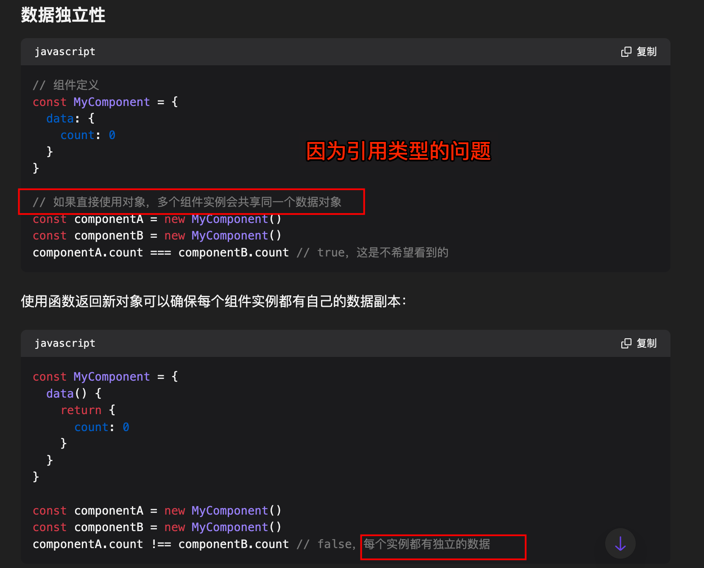

# Vue3 基础：篇一

`#vue3`  `#前端` 


## 目录
<!-- toc -->
 ## 1. Vue 简介 

- Vue 是一个用于构建用户界面的 JavaScript 框架，提供了`声明式渲染`和`响应式更新`等核心功能
- Vue 是一个`渐进式框架`，可以根据需求灵活地选择使用方式，适用于简单到复杂的各种 Web 开发场景
	- 比如 HTML → Web Components   → SPA → SSR → **SSG**  →   桌面端、移动端、WebGL 等

## 2. 单文件组件 SFC

即 Vue 的单文件组件会将一个组件的逻辑 (JavaScript)，模板 (HTML) 和样式 (CSS) 封装在同一个文件里，如下示例：

```vue
<template>
  <button @click="count++">Count is: {{ count }}</button>
</template>

<script setup>
  import { ref } from 'vue'
  const count = ref(0)
</script>

<style scoped>
  button {
  font-weight: bold;
  }
</style>
```

## 3. 组合式 API (Composition API)  vs  选项式 API (Options API)

Vue 有两种主要的 API 风格：`选项式 API` 和`组合式 API`，开发者可以根据喜好和项目需求选择使用。

### 3.1. 选项式 

```vue
<script>
export default {
  // data() 返回的属性将会成为响应式的状态
  // 并且暴露在 `this` 上
  data() {
    return {
      count: 0
    }
  },

  // methods 是一些用来更改状态与触发更新的函数
  // 它们可以在模板中作为事件处理器绑定
  methods: {
    increment() {
      this.count++
    }
  },

  // 生命周期钩子会在组件生命周期的各个不同阶段被调用
  // 例如这个函数就会在组件挂载完成后被调用
  mounted() {
    console.log(`The initial count is ${this.count}.`)
  }
}
</script>

<template>
  <button @click="increment">Count is: {{ count }}</button>
</template>
```


#### 为什么使用函数返回对象？ → 保证每个组件都用独立的对象

> 否则多个组件会共享数据了，因为引用类型的原因




### 3.2. 组合式 + setup

```vue
<script setup>
import { ref, onMounted } from 'vue'

// 响应式状态
const count = ref(0)

// 用来修改状态、触发更新的函数
function increment() {
  count.value++
}

// 生命周期钩子
onMounted(() => {
  console.log(`The initial count is ${count.value}.`)
})
</script>

<template>
  <button @click="increment">Count is: {{ count }}</button>
</template>
```

> 我们要求使用 `组合式 API (Composition API)` +  `<script setup>`

## 4. 使用 Vue3 的几种方式

### 4.1. npm 包引入

```js
import { createApp } from 'vue'

const app = createApp({
  /* 根组件选项 */
})
```

### 4.2. 通过 CDN 使用 Vue

```html
<script src="https://unpkg.com/vue@3/dist/vue.global.js"></script>
<div id="app">{{ message }}</div>

<script>
  const { createApp, ref } = Vue

  createApp({
    setup() {
      const message = ref('Hello vue!')
      return {
        message
      }
    }
  }).mount('#app')
</script>
```

### 4.3. 使用 ES 模块构建版本

> 注意是 `<script type="module">`

```html
<div id="app">{{ message }}</div>

<script type="module">
import { createApp, ref } from 'https://unpkg.com/vue@3/dist/vue.esm-browser.js'

  createApp({
    setup() {
      const message = ref('Hello Vue!')
      return {
        message
      }
    }
  }).mount('#app')
</script>
```

### 4.4. Import maps 方式引用

```vue hl:2
<!-- 这个标签包含一个 JSON 对象，用于定义模块的映射关系。 -->
<script type="importmap">
  {
    "imports": {
      "vue": "https://unpkg.com/vue@3/dist/vue.esm-browser.js"
    }
  }
</script>

<div id="app">{{ message }}</div>

<script type="module">
  import { createApp, ref } from 'vue'

  createApp({
    setup() {
      const message = ref('Hello Vue!')
      return {
        message
      }
    }
  }).mount('#app')
</script>
```

> 注意 `<script type="importmap">` 的兼容性

