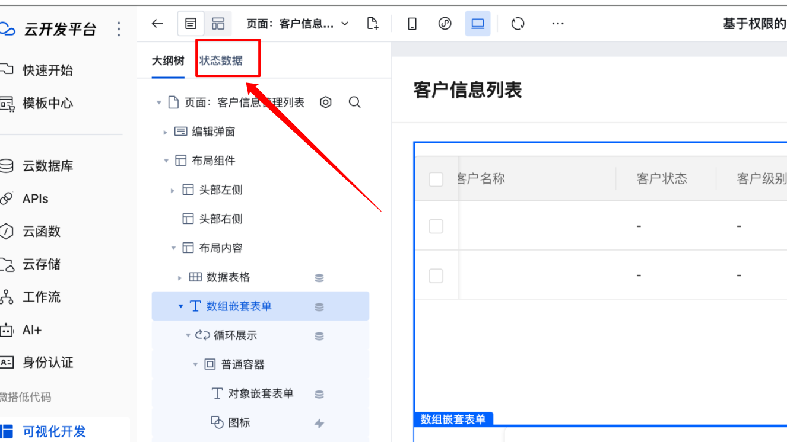
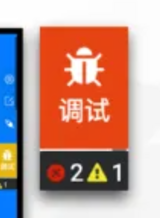

# 低代码平台的调试开发

`#lowcode` 

## 目录
<!-- toc -->
 ## 总结 

- 友好的==低代码开发体验==很重要
- 一些功能点：
	- schema 面板
	- 数据源面板：→ for 开发者
		- 使用 vue-devtools 
	- 控制台：开发日志信息
	- 开发体验及问题反馈
		- debug 图标，告诉用户报错了
		- 问题反馈
			- 一键复制到值班群里
			- 一键关联需求工单系统
		- 常见问题 FAQ 等
- WebIDE

## 1. 开启调试开发

- 新建应用
- 新建应用
- 新建组件
- 管理后台
	- 应用管理
	- 组件管理、本地组件
	- 页面管理
	- 都有开关，可以打开调试模式，默认端口，也可以配置端口

>  因为使用了 [vite-plugin-federation](https://github.com/originjs/vite-plugin-federation)
> 只有主机端支持开发模式，远程端需要使用 vite build 生成 RemoteEntry.js 包。这是因为 Vite 开发模式是无打包的，您可以使用 `vite build --watch` 来实现热更新效果。

## 2. Schema 面板

- json schema 协议校验

>  制定过一版本的 JSON Schema 协议的，后面都是TS 来制定了

## 3. 数据源面板：Vue-DevTools pinia 

参考下图，也可以直接再左侧中查看啊，但没做这个事情

- 数据状态
- 大纲树

>  点击客户互相跳转，类似于编辑器，可以快速搜索

## 4. 开发日志信息

需要在控制台面板打开

## 5. 开发体验及问题反馈

- 通过一个**显眼的标识**来告诉用户，你开发的页面出现错误了
	- 比如 debug 图标
		- 
- 错误信息整理
	- 错误码？
	- `组件 ID` 是多少
	- 用户配置的表达式内容是什么
	- **一键复制**给值班同学，发到反馈群里，方便定位协调问题
		- 因为很多同学都是不同城市的
		- 复制信息是标准化的，比如报错信息，schema 信息等等
- `Schema` 信息的查看
	- 对应==大纲==
- 全局的 pinia 信息数据插件
	- 打开 `Vue-DevTools` 等
		- 内置了 `pinia` 
- 常见问题 FAQ 
- 工单系统能力
	- ==一键截图上报工单需求系统==

## 6. 更高级的玩法

> 基于低代码平台开发一个 DevTools 工具，WebIDE ，等等，甚至搞一个开发者工具 IDE

