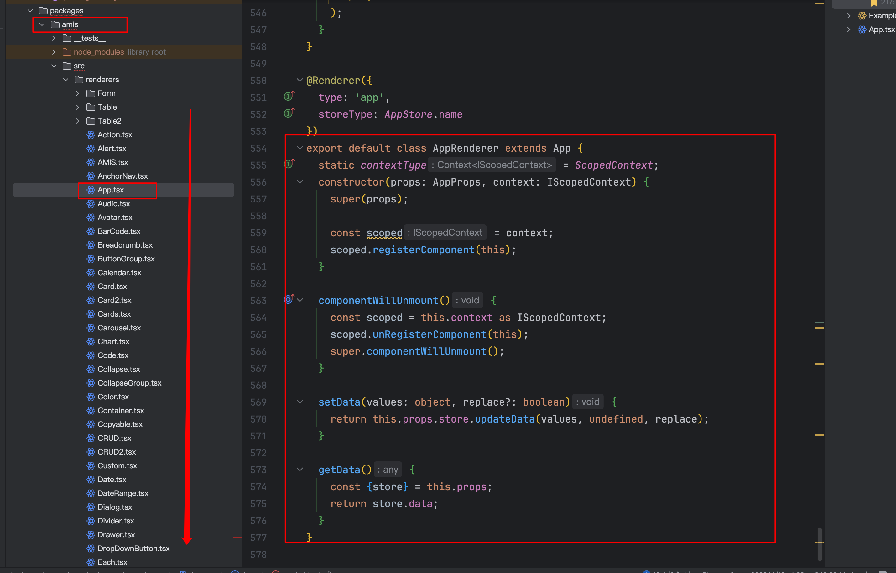
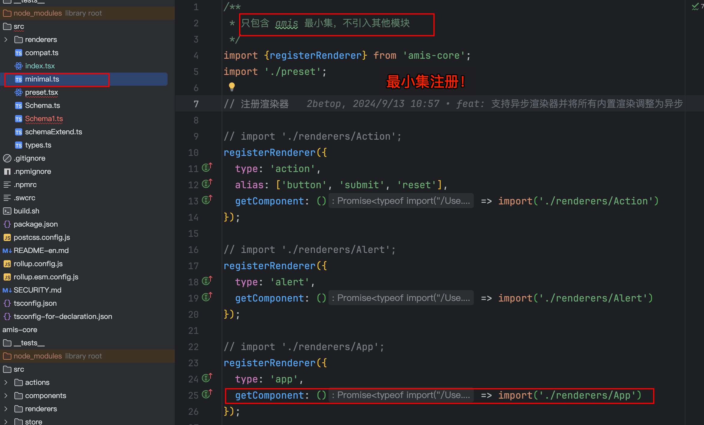

# 调研：Amis 工作原理、自定义组件

`#lowcode` 


## 目录
<!-- toc -->
 ## 1. 工作原理 

- 渲染过程就是根据`节点 type` 信息，跟**组件池**中的找到对应的组件实现
	- 如果命中，则把当前节点转给对应组件渲染，节点中其他属性将作为目标组件的 props。
	- 如果是容器组件，比如以上例子中的 `page` 组件，从 props 中拿到的 `body` 是一个子节点
	- 由于节点类型是不固定，由使用者决定，所以不能直接完成渲染
		- 所以交给属性中下发的 `render` 方法去完成渲染，`{render('body', body)}`，他的工作就是拿子节点的 type 信息去组件池里面找到对应的渲染器，然后交给对应组件去完成渲染。

## 2. 自定义组件：SDK

### 2.1. 属性

| 属性名       | 类型        | 默认值      | 说明                              |
| --------- | --------- | -------- | ------------------------------- |
| type      | 'custom'  |          |                                 |
| id        | `string`  |          | 节点 id                           |
| name      | `string`  |          | 节点 名称                           |
| className | `string`  |          | 节点 class                        |
| inline    | `boolean` | false    | 默认使用 div 标签，如果 true 就使用 span 标签 |
| html      | `string`  |          | 初始化节点 html                      |
| onMount   | `string`  | Function | 节点初始化之后调的用函数                    |
| onUpdate  | `string`  | Function | 数据有更新的时候调用的函数                   |
| onUnmount | `string`  | Function | 节点销毁的时候调用的函数                    |

### 2.2. onMount

这是节点在初始化的时候执行的函数，它接收三个参数：
- dom
	- 组**件加载之后的 dom 节点**
- data
	- 组件初始值，需要设置 name
- onChange
	- 修改这个组件对应 name 的值
- props，后面会单独介绍

```javascript
{
  type: 'page',
  title: '表单页面',
  body: {
    type: 'form',
    title: 'custom 组件',
    body: [
      {
        type: 'custom',
        name: 'myName',
        label: '自定义组件',
        onMount: (dom, value, onChange, props) => {
          const button = document.createElement('button');
          button.innerText = '点击修改';
          button.onclick = event => {
            // 这个 onChange 方法只有放在表单项中才能调用，第二个参数是表单项名称
            onChange('new', 'myName');
            event.preventDefault();
          };
          dom.appendChild(button);
        }
      },
    ]
  }
}
```

-  `type = free`
	- 模块联邦的方式嵌入

### 2.3. props

前面可以看到所有函数最后都有一个 `props 参数`，在这个参数里能拿到 amis 内部属性和方法，比如弹框

```javascript hl:6
onMount: (dom, data, onChange, props) => {
  const button = document.createElement('button');
  button.innerText = '点击修改姓名';
  button.onclick = event => {
    onChange('new name', 'name');
    props.onAction(
      event,
      {
        type: 'action',
        label: '弹个框',
        actionType: 'dialog',
        dialog: {
          title: '弹框',
          body: 'Hello World!'
        }
      },
      {} // 这是 data
    );
    event.preventDefault();
  };
  dom.appendChild(button);
};
```

> 或者执行 `props.env.notify('success', '执行成功')` 来在右上角弹出提示等

### 2.4. onUpdate

```javascript
onUpdate: (dom, data, prevData, props) => {
    console.log('data', data, prevData)
}
```

### 2.5. vue

```javascript
{
  type: 'page',
  title: '表单页面',
  body: {
    type: 'form',
    title: 'custom 组件',
    body: [
      {
        type: 'custom',
        name: 'my-custom',
        html: `
        <ol>
          <li v-for="todo in todos">
            {{ todo.text }}
          </li>
        </ol>
        `,
        label: '自定义组件',
        onMount: (dom, data, onChange, props) => {
          const app = new Vue({
            el: dom,
            data: {
              todos: [
                { text: 'hello' },
                { text: 'world' },
                { text: 'vue' }
              ]
            }
          })
        }
      }
    ]
  }
}
```

## 3. 自定义组件：React

### 3.1. 组件间通信：上下文机制

- 一个好的思路，需要再注册，运行时实例注册进来，方便通讯，那么和数据流有什么关系？
- `Scoped.tsx`会把里面的**运行时实例注册进来**，方便组件之间的通信

amis 中有个机制就是，把需要被引用的组件设置一个 name 值，然后其他组件就可以通过这个 name 与其通信

```js hl:2,11,16
import * as React from 'react';
import {Renderer, ScopedContext} from 'amis';
@Renderer({
  type: 'my-renderer'
})
export class CustomRenderer extends React.Component {
  static contextType = ScopedContext;

  constructor() {
    const scoped = this.context;
    scoped.registerComponent(this);
  }

  componentWillUnmount() {
    const scoped = this.context;
    scoped.unRegisterComponent(this);
  }

  // 其他部分省略了。
}
```

看看 `ScopedContext` 定义

```typescript
export interface IScopedContext {  
  rendererType?: string;  
  component?: ScopedComponentType;  
  parent?: AliasIScopedContext;  
  children?: AliasIScopedContext[];  
  registerComponent: (component: ScopedComponentType) => void;  
  unRegisterComponent: (component: ScopedComponentType) => void;  
  getComponentByName: (name: string) => ScopedComponentType;  
  getComponentById: (id: string) => ScopedComponentType | undefined;  
  getComponentByIdUnderCurrentScope: (  
    id: string,  
    ignoreScope?: IScopedContext  
  ) => ScopedComponentType | undefined;  
  getComponents: () => Array<ScopedComponentType>;  
  reload: (target: string, ctx: RendererData) => void | Promise<void>;  
  send: (target: string, ctx: RendererData) => void;  
  close: (target: string) => void;  
  closeById: (target: string) => void;  
  getComponentsByRefPath: (  
    session: string,  
    path: string  
  ) => ScopedComponentType[];  
  doAction: (actions: ListenerAction | ListenerAction[], ctx: any) => void;  
}
```

### 3.2. env 对象

自定义的渲染器 props 会下发一个非常有用的 **env 对象**。这个 env 有以下功能方法。

- `env.fetcher` 可以用来做 ajax 请求
	- 如： `this.props.env.fetcher('xxxAPi', this.props.data).then((result) => console.log(result))`
- `env.confirm` 确认框，返回一个 promise 等待用户确认
	- 如： `this.props.env.confirm('你确定要这么做？').then((confirmed) => console.log(confirmed))`
- `env.alert` 用 Modal 实现的弹框
- `env.notify` toast 某个消息 
	- 如： `this.props.env.notify("error", "出错了")`
- `env.jumpTo` 页面跳转。

>  这些很多公用方法也可以封装 pinia 里面了


## 4. amis 内置了调试工具

可以查看组件内部运行日志，方便分析问题，目前在文档右侧就有显示。

默认不会开启这个功能，可以通过下面三种方式开启：
1. render 的 env 里设置 `enableAMISDebug`。
2. 配置全局变量 `enableAMISDebug` 的值为 `true`，比如 `window.enableAMISDebug = true`。
3. 在页面 URL 参数中加上 `amisDebug=1`，比如 `http://xxx.com/?amisDebug=1`。

## 5. 多包结构

- 使用 `pnpm workspace`

### 5.1. 组件包：所有的组件入口



- 必须统一都在一个地方写，并且必须有规范，比如样式、vue、schema 文件等等

### 5.2. 组件注册，使用最小集来注册，避免包过大




