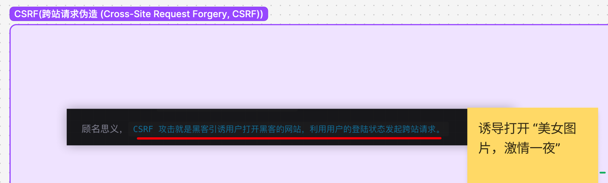
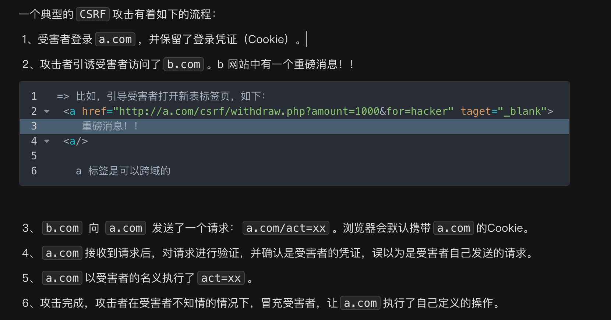
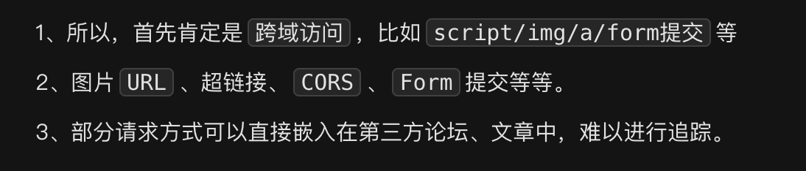
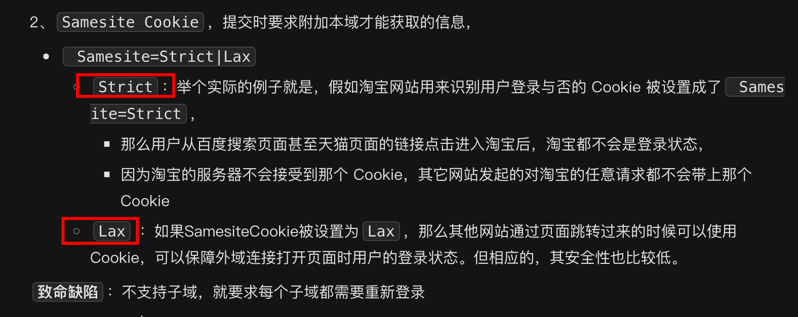
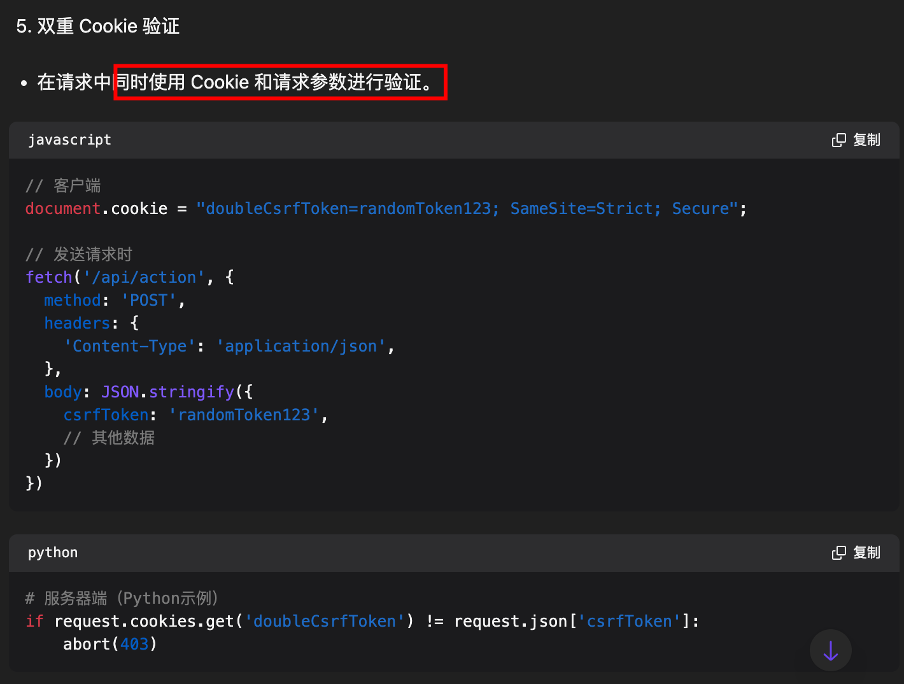
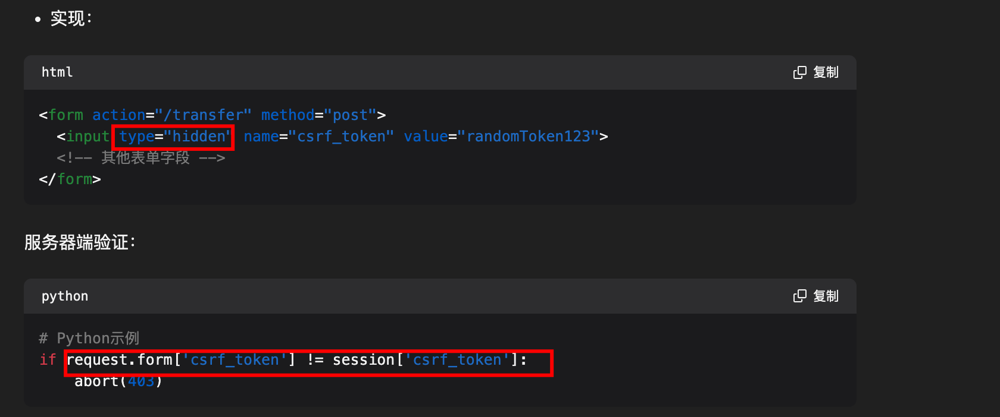
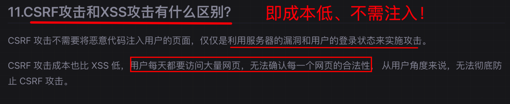

# CSRF：跨站请求伪造

`#前端安全`  


## 目录
<!-- toc -->
 ## 1. 总结 

- 定义
	- 攻击者**诱导已登录用户在不知情的情况下，向服务器发送非预期的请求**。
	- 攻击者**利用用户已登录的身份**，以用户的名义执行某些操作
- 特点
	- 肯定是==跨域==
		- script、img 、a、form 提交等
		- 使用 js 实现自动提交表单
	- 不好追踪，很多请求嵌入到第三方论坛中
- 攻击流程：转账请求
	1. 用户登录了银行网站 A，获得了 Cookie 
	2. 诱惑用户访问恶意网站 B
	3. B 网站包含一个自动提交的表单，指向 A 网站的转账接口（比如可以跨域的标签 a）
	4. 表单自动提交，携带用户在 A 网站的 Cookie
	5. A 网站收到请求，验证 Cookie 有效，执行转账
- ==CSRF 防御措施==
	- CSRF Token
	- SameSite Cookie 属性
		- Strict 
		- Lax
	- 缩短会话时间
	- 双重 token 
	- 重要操作二次验证，比如密码或者人脸失败登
	- API 调用：对于 AJAX 请求，可以**添加自定义头**
		- 相等于重要入口**必须通过特定的自己的 js 发起Ajax**，直接访问不行
		- header 头 X-CSRF-Toke
	- CSP 
		- 限制可以加载资源的来源
	- 风险安全提示：
		- 知乎外跳链接


---

> 关键点：引导到黑客的网站



## 2. CSRF 的基本概念

CSRF 是一种网络攻击方式
- 攻击者**诱导已登录用户在不知情的情况下，向服务器发送非预期的请求**。
- 攻击者**利用用户已登录的身份**，以用户的名义执行某些操作。

## 3. CSRF 攻击原理

假设一个典型的攻击场景：

```bash
1. 用户登录了银行网站 A，获得了 Cookie
2. 用户访问恶意网站 B (诱惑用户访问 B)
3. B 网站包含一个自动提交的表单，指向 A 网站的转账接口（比如可以跨域的标签 a）
4. 表单自动提交，携带用户在 A 网站的 Cookie
5. A 网站收到请求，验证 Cookie 有效，执行转账
```

## 4. CSRF 攻击示例

### 4.1. GET 类型攻击

- 在 B 网站发起
- 或者注入到 A 网站的评论等

```html
<!-- 恶意网站中的图片 -->

```

### 4.2. POST 类型攻击：自动提交表单

```html
<!-- 自动提交的表单 -->
<form action="http://bank.example/transfer" method="POST" id="hack-form">
    <input type="hidden" name="to" value="hacker"/>
    <input type="hidden" name="amount" value="1000"/>
</form>
<script>
    document.getElementById('hack-form').submit();
</script>
```

## 5. CSRF 防御措施

### 5.1. CSRF Token

```javascript hl:7
// 服务端生成 Token
const csrfToken = generateRandomToken();
session.csrfToken = csrfToken;

// 客户端表单
<form action="/transfer" method="POST">
    <input type="hidden" name="_csrf" value="<%=csrfToken%>">
    <!-- 其他表单字段 -->
</form>

// 服务端验证
if (request.body._csrf !== session.csrfToken) {
    throw new Error('CSRF token validation failed');
}
```

### 5.2. Double Submit Cookie

```javascript
// 客户端设置
document.cookie = "csrfToken=randomToken";

// AJAX 请求头
fetch('/api/transfer', {
    method: 'POST',
    headers: {
        'X-CSRF-Token': getCookie('csrfToken')
    },
    body: JSON.stringify(data)
});
```

### 5.3. SameSite Cookie 属性

```
Set-Cookie: sessionId=abc123; SameSite=Strict
Set-Cookie: sessionId=abc123; SameSite=Lax
```

### 5.4. 验证 Origin/Referer

```javascript
// 服务端验证示例
app.use((req, res, next) => {
    const origin = req.get('Origin');
    const referer = req.get('Referer');
    
    if (!isValidOrigin(origin) || !isValidReferer(referer)) {
        return res.status(403).json({ error: 'Invalid origin' });
    }
    next();
});
```

## 6. 各框架的 CSRF 防护实现

### 6.1. Express.js (使用 csurf 中间件)

```javascript
const csrf = require('csurf');
const csrfProtection = csrf({ cookie: true });

app.use(csrfProtection);

app.get('/form', (req, res) => {
    res.render('form', { csrfToken: req.csrfToken() });
});
```

## 7. 最佳实践建议

### 7.1. **分层防御**

   - 同时使用多种防御措施
   - 合理配置 Cookie 属性
   - 实施严格的访问控制

### 7.2. **安全配置**

```javascript
// Cookie 配置
Set-Cookie: sessionId=abc123; HttpOnly; Secure; SameSite=Strict

// CSP 配置
Content-Security-Policy: default-src 'self'
```

### 7.3. **关键操作验证**：添加二次验证

```javascript
// 重要操作增加二次验证
async function performCriticalOperation() {
    // 验证 CSRF Token
    if (!validateCsrfToken()) return false;
    
    // 要求用户输入密码或验证码
    const verification = await requestUserVerification();
    if (!verification.success) return false;
    
    // 执行操作
    return performOperation();
}
```

## 8. CSRF 防护检查清单

- **基础防护**
	- [ ] 使用 CSRF Token
	- [ ] 设置 SameSite Cookie
	- [ ] 验证 Origin/Referer
- **Cookie 安全**
	- [ ] 设置 HttpOnly
	- [ ] 设置 Secure
	- [ ] 合理设置过期时间
- **请求验证**
	- [ ] 验证 Content-Type
	- [ ] 检查请求方法
	- [ ] 验证 Token 有效性
- **额外安全措施**
	- [ ] 重要操作二次验证
	- [ ] 监控异常请求
	- [ ] 日志记录

## 9. 常见问题和解决方案

1. **Token 刷新问题**
```javascript
// 在 AJAX 请求中刷新 Token
function refreshCsrfToken(response) {
    const newToken = response.headers.get('X-CSRF-Token');
    if (newToken) {
        updateStoredToken(newToken);
    }
}
```

2. **多标签页同步**
```javascript
// 使用 localStorage 在标签页间同步 Token
window.addEventListener('storage', (e) => {
    if (e.key === 'csrfToken') {
        updateCsrfToken(e.newValue);
    }
});
```

3. **API 调用问题**
```javascript
// 统一处理 API 请求
const api = {
    request(url, options = {}) {
        return fetch(url, {
            ...options,
            headers: {
                ...options.headers,
                'X-CSRF-Token': getCsrfToken()
            }
        });
    }
};
```

## 10. 其他笔记

### 10.1. 一个示例



### 10.2. 特点



### 10.3. 如何规避

- 严格的同源策略，两种策略 **strict 和 Lax** 
	- 示例：`Set-Cookie: session=abc123; SameSite=Strict; Secure`
	- 
- **较短的会话时间**可以减少 CSRF 攻击的窗口期
- 双重 cookie
	- 
- **重要操作进行二次验证**，比如重新输入密码
- 使用 `CSRF Token`
	- 服务器为每个用户会话生成一个唯一的令牌，并在每个表单中包含这个令牌
	- 
- 重要操作，需要验证码提示
- 对于 AJAX 请求，可以**添加自定义头**
	- 相等于重要入口**必须通过特定的自己的 js 发起Ajax**，直接访问不行
- **避免 get 请求**，
	- 至少避免直接通过 a 跨域访问了
- CSP 
	- 限制可以加载资源的来源
- 风险安全提示：
	- 当前用户打开其他用户填写的链接时，需告知风险（**知乎跳转外链**，等等都会告知风险）

### 10.4. 与 XSS 的区别



>  因为注入是需要成本和一些条件的