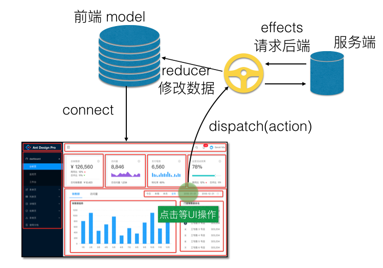
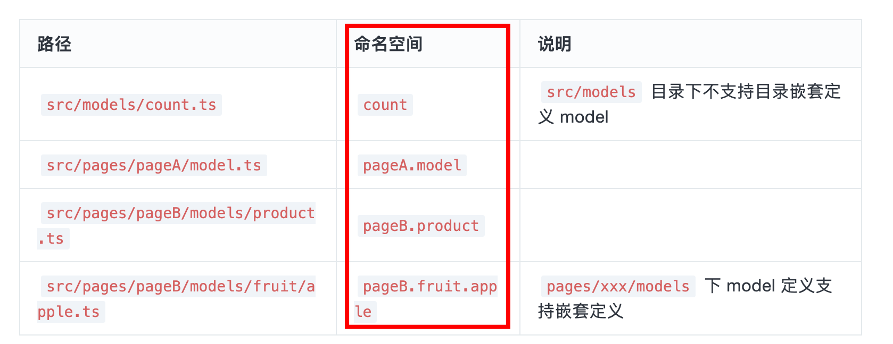
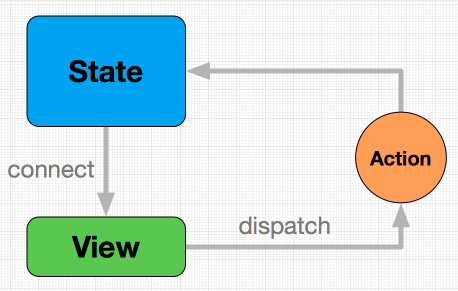

# 聊聊最新的 umi

`#react` `#R1` 


## 目录
<!-- toc -->
 ## 1. Umi 如何管理状态 



### 定义示例

```javascript
import React, { Component } from "react";
import { connect } from "umi";

@connect(({ user }) => ({
  user,
}))
class UserInfo extends Component {
  constructor(props) {
    super(props);
  }
  render() {
    return <div>{this.props.user.name}</div>;
  }
}

export default UserInfo;

```

### 使用示例

```javascript hl:4
import React, { Component } from "react";
import { connect } from "umi";

@connect(({ user }) => ({
  user,
}))
class UserInfo extends Component {
  constructor(props) {
    super(props);
  }
  render() {
    return <div>{this.props.user.name}</div>;
  }
}

export default UserInfo;

```

## 2. 最新的 Hooks 数据流



### 2.1. counterModel

```javascript
// src/models/counterModel.ts
import { useState, useCallback } from "react";

export default function Page() {
  const [counter, setCounter] = useState(0);

  const increment = useCallback(() => setCounter((c) => c + 1), []);
  const decrement = useCallback(() => setCounter((c) => c - 1), []);

  return { counter, increment, decrement };
}

```

### 2.2. 请求数据

```javascript
// src/models/userModel.ts
import { useState } from "react";
import { getUser } from "@/services/user";

export default function Page() {
  const [user, setUser] = useState({});
  const [loading, setLoading] = useState(true);

  useEffect(() => {
    getUser().then((res) => {
      setUser(res);
      setLoading(false);
    });
  }, []);

  return {
    user,
    loading,
  };
}

```

### 2.3. 和 Vue3 的 pinia

是不是特别像，除了支持放到 pages 下的 model 管理

## 3. Dva 



- namespace
    - model 的命名空间，同时也是他在全局 state 上的属性，只能用字符串，不支持通过 `.` 的方式创建多层命名空间
- state
    - 初始值
- reducers
    - 纯函数，以 key/value 格式定义 reducer。用于处理同步擦做，唯一可以修改 `state` 的地方，由 `action` 触发
    - 格式为：`(state, action) => newState` 或 `[(state, action) => newState, enhancer]`
- effects
    - 处理异步操作和业务逻辑，以 `key/value` 格式定义 effect
    - 不直接修改 state。由 action 触发
    - call：执行异步操作
    - put：发出一个 Action，类似于 dispatch
- subscriptions
    - 订阅
    - 在 `app.start()` 时被执行，数据源可以是当前的时间、服务器的 websocket 链接、 keyboard 输入、history 路由变化、geolocation 变化等等

```javascript
import React, { Component } from "react";
import { connect } from "umi";

const mapModelToProps = (allModels) => {
  return {
    test: "hello world",
    // props you want connect to Component
  };
};

@connect(mapModelToProps)
class UserInfo extends Component {
  render() {
    return <div>{this.props.test}</div>;
  }
}

export default UserInfo;

```
