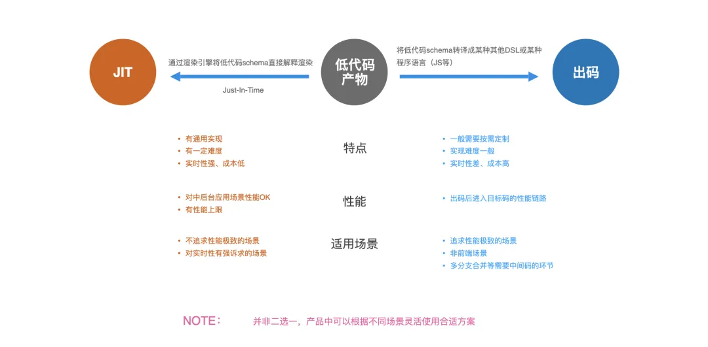
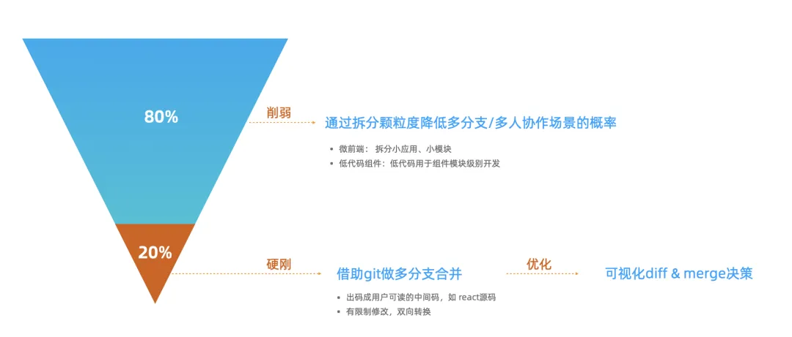
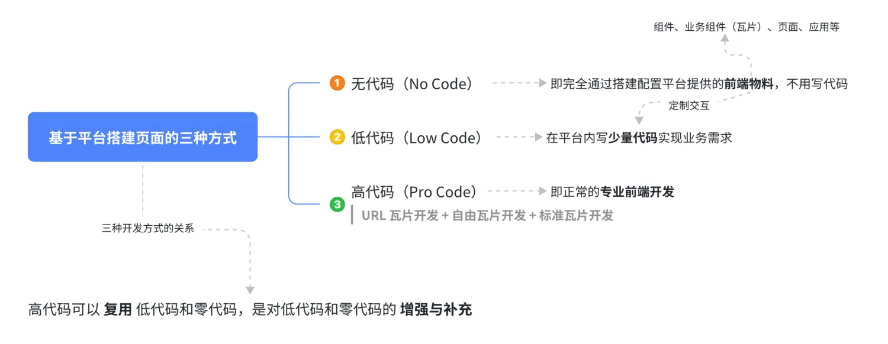
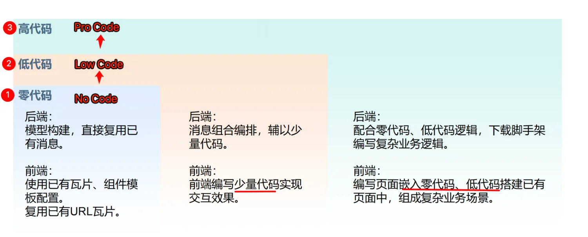
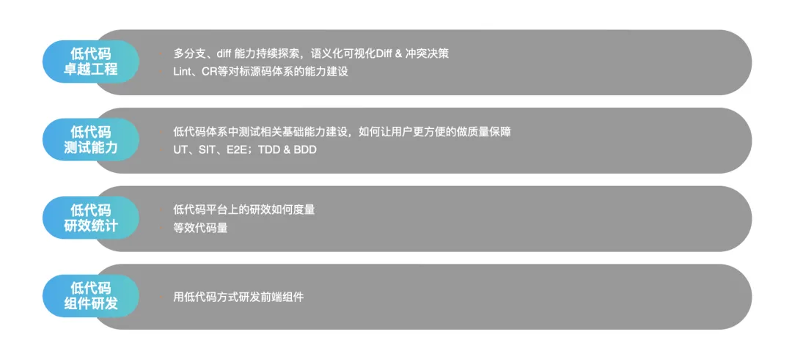
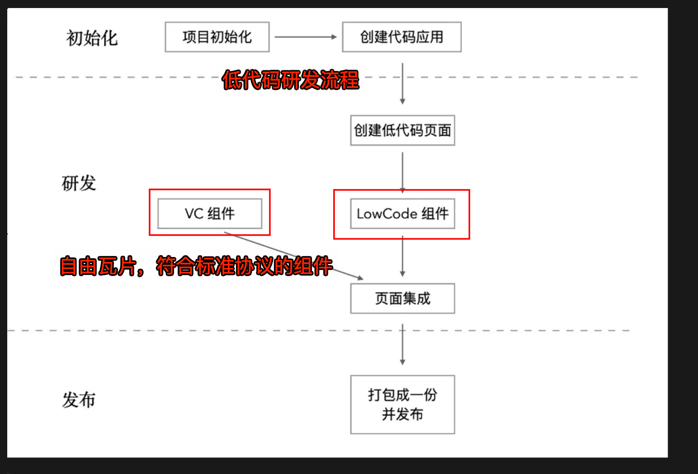
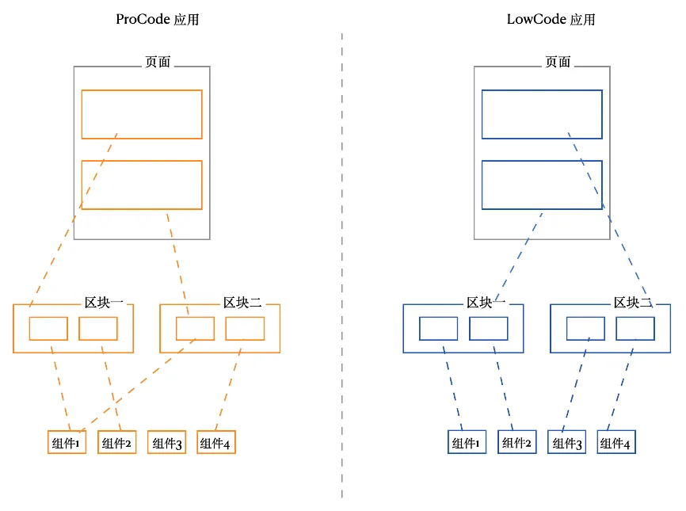
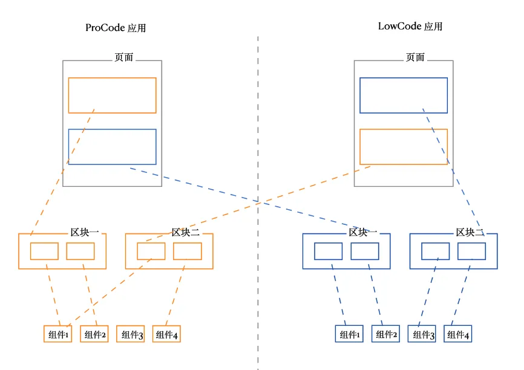
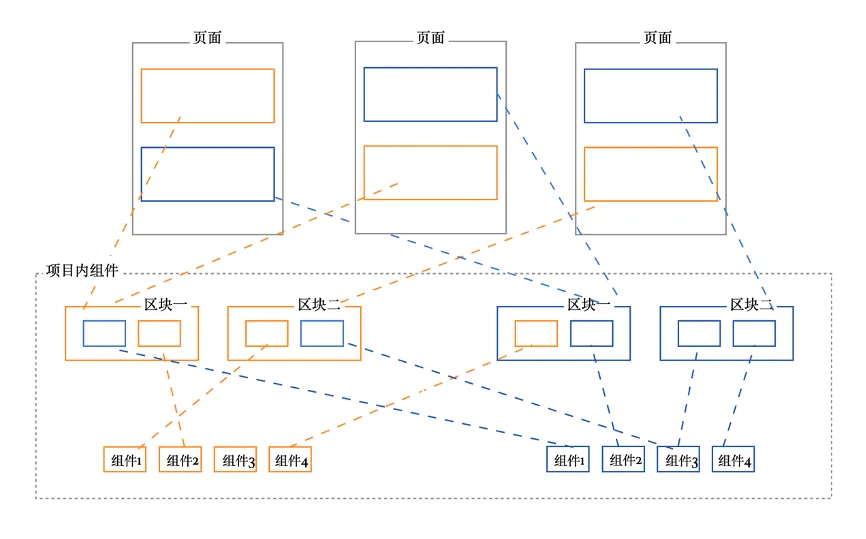

# 低代码的研发搭建模式探讨

`#lowcode` 

## 目录
<!-- toc -->
 ## 1. 背景 

- ==不同形态解决不同场景问题的低代码产品==
	- 包括模型驱动、API驱动、流程表单搭建、小程序搭建、零代码搭建、业务配置化等众多场景
	- 从降本、体系、业务赋能、解资源瓶颈等多方面起到了不错的成效；
- 所以**低代码平台本质上是个产品而非技术中间件** 

---

> 一句话：面向制造行业数字转型的低代码研发平台

看看当下的背景
- 工业领域做了不少项目，大多数西门子的实施代理
- 希望每次做一个项目，能够逐渐沉淀下来
- 客户群体：
	- 制造业
		- 海尔
		- 广汽等
	- 军工
	- 国企央企
- 明确国产化，不用国外的工业软件，比如西门子等，所以**对技术栈有要求**
	- ==国产数据库==
	- 华为设备
	- 比如前端要求是 Vue3 
	- 等等
- 大部分项目有涉密场景
- 已经实施过很多项目，这些项目怎么办？
	- ==如何回收==？
	- 如何继续迭代？
	- 等等

## 2. 为什么要低代码

### 2.1. 资源瓶颈

- 专业前端 -> 非专业前端
- 需要前端 -> 无需前端
- 需要研发 -> 无需研发
- BI开发 -> BI + 业务运营自交付
- ...

### 2.2. 交付提效

#### 2.2.1. 模型驱动

- 模型驱动：
	- 一般是指通过服务端的模型定义，自动生成全套CRUD页面的模式
	- 通常是提供给服务端开发同学，用来开发具备一般规律的基本管理页面的。
	- 模型驱动又分两种模式
		- 一种是从**最底层模型设计**开始，把服务端代码编写的部分也低代码化
			- 这种对于一般研发团队来说==与现有存量业务结合比较困难==，对于后续系统维护和优化也不够友好。
		- 另一种更适合的方案是 **API 驱动**
			- 通过基于**OneApi/OpenAPI等协议描述**的接口信息，驱动生产全套CRUD的界面
			- 该模式对服务端开发的既有模式几乎没什么改变，也是目前企业智能团队应用最广泛的模式。

> 提供两种数据能力：智能体厂 + API 编排

### 2.3. 业务赋能

- 数字化转型背景下
	- 在于行业背景，**行业提效，沉淀行业最佳实践，或者 SOP** 

## 3. 现有团队情况

- 存量的产品、存量的组件，存量的技术沉淀如何对待？
- 这==技术本质==是 **低代码的产物如何与源码的产物如何融合的问题**
- 最好是：
	- 满足低代码和源码两种生产方式可以**同时存在**
	- 且兼顾联调体验；
	- 解决方案：
		- 通过**微前端、模块联邦等技术**，让低码和源码的产物可以充分融合渲染

## 4. 出码还是渲染

针对工业软件的平台分析
- ==实时性==要求
- 中后台偏多
- 人员能力
	- 出码技术要求相对较高
	- 且交互周期相对长

### 4.1. 出码

出码的两种形态：**单向转换和双向转换**
- 理论上两种模式都能实现，但同样的还是要匹配到**合适的用户合适的使用场景**上。
- 单向转换
	- 非前端页面场景，需要转成特定 DSL 或 目标语言
	- 比如==转向小程序==
	- 性能优化链路
		- 需要源码作为客户交付物
		- 可以转成更熟悉可读的DSL
	- 劣势：**代码修改后无法转回**
- 双向转换
	- 要牺牲灵活性，转成有约束的DSL
	- 劣势：
		- 新 DSL 对用户不友好，学习成本高，与业界通用技能脱节
	- 适用场景：
		- 多分支合并等场景作为中间码使用

> 出码不好的点在于，出==码那一刻技术加锁定了==

### 4.2. 选择

建议选择**渲染方案** ，而非**出码方案**

> 未来真需要出码，技术也是可以做到的

## 5. 如何协作并行开发？

- 传统源码思维里，涉及到多人协作，多迭代，解法就是 **git 版本管理**
- 低代码领域，更推荐**产品思维**
	- 从用户视角出发，本身平台提供的便是低代码甚至是零代码，在这个前提下，版本 diff 合并这样的操作是违和的。

### 5.1. 业界建议的思路是：

- 首先要削弱：
	- 通过**产品设计**，对可能产生多分支协作的场景**尽可能的规避**
	- 理论上**用户操作的单元越小**，产生多人/多迭代同时操作的可能性就越低。
- 削弱过后
	- 可能解决80%的问题，剩下的就需要**硬刚**
		- 这里面可以还是借助 git 的成熟体系，通过出码等方式讲低码转换成用户可理解的DSL 进行 diff 和merge。
- 最后**低代码产品还是要回归低码的心智**
	- 对多分支的产品形态要进行**优化**, 这里重点是落在可视化diff和merge的决策辅助上，低代码产品的用户，通过可视化编排的方式生产，那也需要通过可视化的方式来查看差异；
	- 同样对于冲突的解决，也需要更加低成本低门槛的决策方式。
	- 在这个部分，UIPaaS 目前也处于前期探索阶段。

### 5.2. 我们的思路是：

- ==没有出码，只有运行时==
- 存量的系统产品业务，继续 Run，通过**微前端**的方式集成到低代码平台
	- 尽量不维护，但是特别场景，交付紧急的场景继续通过传统的开发方式维护迭代
- 增量业务都**要求按照低代码的研发模式**
- 因为低代码也在持续研发过程中，实在满足不了的场景
	- 通过`模块联邦`的方式，**自由组件开发**，这是一种**纯高代码开发模式**

## 6. 开发与搭建模式

目前市面上的低代码都会提供正常三种模式，如下图

他们的关系如下图：

> 更到可参考 [1. 分享：基于低代码平台的三种开发模式](/post/Wel2FVUi.html)

## 7. 更多

## 8. LowCode 与 ProCode 的==混合研发模式==

### 8.1. 关键要点

- 在某些复杂应用难以适配的问题如何解决?
- 理想的混合研发链路需要**解决多分支管理、组件统一管理以及一体化打包构建**等问题,但实施成本较高。
- 一种轻量级的混合研发链路可以通过应用集成和页面集成在低代码平台上完成，简化了分支管理和组件引用的问题。
- 页面研发应实现应用层面和页面层面的融合，组件可以在 Pro代码 和 低代码应用间互相引用。
- 未来可以进一步探索,不再区分Pro代码和低代码页面,而是采用工业领域物料清单的方式组装页面

### 8.2. 低代码研发流程

### 8.3. 现状

#### 8.3.1. 组件类型分类

- VC 组件：中后台低代码组件，符合《低代码引擎物料协议规范》，可以在低代码页面中使用的组件
	- 类比于 **自由组件**（能科的叫自由瓦片）
- 低代码组件：
- PRO Code：纯外部组件

#### 8.3.2. 问题

- VC 组件 和 LowCode 组件都是一个个的包，需要进行**复杂的包管理**
- VC 组件不受低代码平台强控制，比如分支都没有
	- **能约束的就是一个脚手架，之后就是泼出去的水了**
	- 一个解法是：项目组一个大仓库来管理，大的包管理

### 8.4. 解法

- 低代码平台上维护所有组件类型
- Pro Code 组件 & 自由组件大仓库管理，按版本管理

### 8.5. 不同组件是如何引用的？

#### 8.5.1. 完全独立，如下图：

解法：
- 通过 URL 嵌入的方式
- 通过无界微前端的方式直接陷入

#### 8.5.2. 简单的融合

- 要么分别创建 ProCode 应用和 LowCode 应用再做集成
- 要么以 `iframe` 的形式嵌入

#### 8.5.3. 理想的融合方式

- 应用上不做 ProCode 应用和 LowCode 应用的区分
- 页面上不区分 ProCode 还是 LowCode 的组件和模块，都有一致的引入方式。
	- ProCode 的模块/组件 和 LowCode 的模块和组件在研发态有区分，但是在消费态有一致的表现
- 页面、模块类型和组件可以让用户自己决定是用 ProCode 还是 LowCode

## 9. 参考

- https://mp.weixin.qq.com/s/Ynk_wjJbmNw7fEG6UtGZbQ