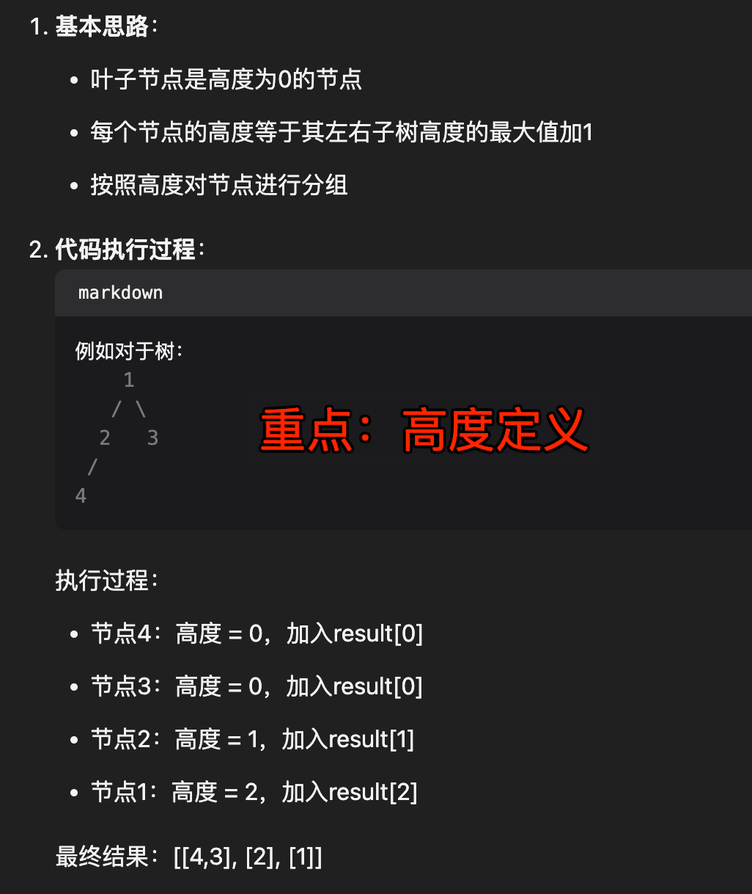
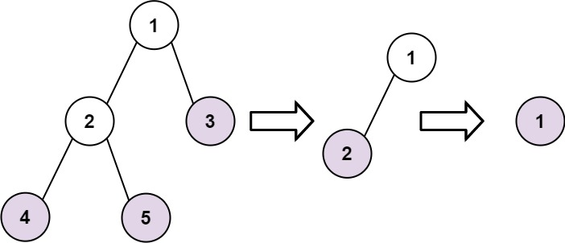

# 寻找二叉树的叶子节点


> [366. 寻找二叉树的叶子节点](https://leetcode.cn/problems/find-leaves-of-binary-tree/)


## 目录
<!-- toc -->
 ## 1. 代码 

节点的高度：
- 即`该节点`到`它的叶子节点`的距离
	- 当前节点的高度是`左右子树高度的最大值 + 1`
- `空节点`的高度定义为 `-1`

```javascript
var findLeaves = function (root) {
    const res = [];
    // 返回：节点的高度
    function getHeight(node) {
        // 空节点的高度定义为 -1
        if (!node) return -1;
        const left = getHeight(node.left);
        const right = getHeight(node.right);
        // 当前节点的高度 = 左右子树高度的最大值 + 1
        const height = Math.max(left, right) + 1;
        if (!res[height]) {
            res[height] = [];
        }
        res[height].push(node.val);
        return height;
    }
    getHeight(root);
    return res;
};
```

## 2. 思路



## 3. 题目

- 收集所有的叶子节点。
- 移除所有的叶子节点。
- 重复以上步骤，直到树为空



