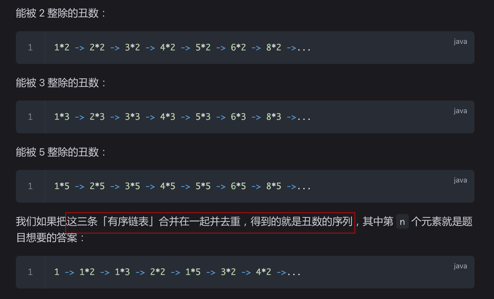

# 丑数 II


> [264. 丑数 II](https://leetcode.cn/problems/ugly-number-ii/)


## 目录
<!-- toc -->
 ## 分析 

- **丑数** 就是质因子只包含 `2`、`3` 和 `5` 的正整数。
	- 如果一个数 `x` 是丑数，那么 `x * 2, x * 3, x * 5` 都一定是丑数

## 思路



所以可以了  [23. 合并 K 个升序链表](/post/bAnXiD4w.html) 的思路

## 代码

```javascript
/**
 * @param {number} n
 * @return {number}
 */
var nthUglyNumber = function (n) {
  let res = [1];
  // 三个指针，分别代表乘以 2,3,5 的【位置】
  let p2 = 0;
  let p3 = 0;
  let p5 = 0;
  while (res.length < n) {
    let next2 = res[p2] * 2;
    let next3 = res[p3] * 3;
    let next5 = res[p5] * 5;
    // 下一个丑数
    let next = Math.min(next2, next3, next5);
    // 移动指针
    if (next === next2) p2++;
    if (next === next3) p3++;
    if (next === next5) p5++;
    res.push(next);
  }
  return res[n - 1];
};
```


