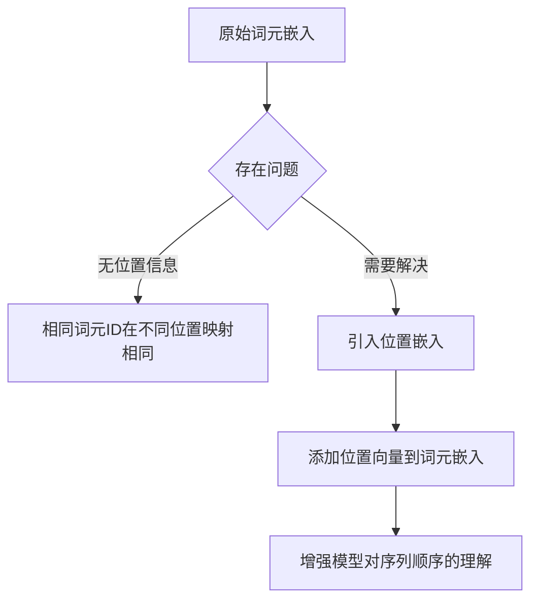

# 编码单词位置信息：为词元嵌入添加位置感知能力

`#2026/01/01` `#ai`


## 目录
<!-- toc -->
 ## 1. 问题背景 

在大语言模型中，词元嵌入存在一个`关键缺陷`：自注意力机制无法感知**词元在序列中的位置或顺序**。这意味着无论词元ID在输入序列的哪个位置，都会被映射到相同的向量表示。


`嵌入层`始终将相同的词元 ID 转换为相同的向量表示，不受其在输入序列中的位置的影响。例如，无论`词元 ID 为 5` 的词元出现在输入向量的`第一个位置`还是`第四个位置`，它都将被映射为相同的嵌入向量

## 2. 位置嵌入的必要性流程图



## 3. 位置嵌入的两种策略

### 3.1 绝对位置嵌入（Absolute Positional Embedding）

```python
import torch  

# 创建绝对位置嵌入层  
class AbsolutePositionalEmbedding:  
    def __init__(self, max_length, embedding_dim):  
        # 创建位置索引  
        self.position_indices = torch.arange(max_length)  
        
        # 创建位置嵌入层  
        self.pos_embedding_layer = torch.nn.Embedding(max_length, embedding_dim)  
    
    def __call__(self, token_embeddings):  
        # 获取当前输入的序列长度  
        batch_size, seq_len, embedding_dim = token_embeddings.shape  
        
        # 生成位置索引  
        pos_indices = torch.arange(seq_len, device=token_embeddings.device)  
        
        # 获取位置嵌入  
        pos_embeddings = self.pos_embedding_layer(pos_indices)  
        
        # 将词元嵌入和位置嵌入相加  
        return token_embeddings + pos_embeddings.unsqueeze(0)  

# 示例使用  
vocab_size = 50257  
embedding_dim = 256  
max_length = 4  

# 创建词元嵌入层  
token_embedding_layer = torch.nn.Embedding(vocab_size, embedding_dim)  

# 创建位置嵌入层  
pos_embedding = AbsolutePositionalEmbedding(max_length, embedding_dim)  

# 随机生成词元ID  
input_ids = torch.randint(0, vocab_size, (2, 4))  # batch_size=2, seq_len=4  

# 转换词元ID为嵌入向量  
token_embeddings = token_embedding_layer(input_ids)  

# 添加位置嵌入  
input_embeddings = pos_embedding(token_embeddings)  

print("输入词元ID形状:", input_ids.shape)  
print("词元嵌入形状:", token_embeddings.shape)  
print("加入位置嵌入后的形状:", input_embeddings.shape)  
```

### 3.2 相对位置嵌入（Relative Positional Embedding）

相对位置嵌入关注词元之间的相对距离，而非绝对位置。这种方法使模型能够更好地适应不同长度的序列。

## 4. 关键特点解析

1. `位置嵌入向量`的维度与词元嵌入向量相同
2. 可学习的位置嵌入（如GPT模型）
3. 在训练过程中优化位置嵌入权重


在输入处理流水线中，输入文本首先被分割为独立的词元。随后，这些词元通过词汇表转换为词元 ID。这些词元 ID 继而被转换为嵌入向量，并添加与之大小相同的位置嵌入，最终形成用于大语言模型核心层的输入嵌入

## 5. 代码实践建议

- 绝对位置嵌入适合固定长度的序列
- 相对位置嵌入更灵活，适合可变长度序列
- 位置嵌入维度通常与词元嵌入维度相同

## 6. 示例输出解释

```
输入词元ID形状: torch.Size([2, 4])  
词元嵌入形状: torch.Size([2, 4, 256])  
加入位置嵌入后的形状: torch.Size([2, 4, 256])  
```

上述输出显示：

- 批次大小为2
- 序列长度为4
- 嵌入维度为256
- 位置嵌入成功添加到词元嵌入中

## 7. 重点提示

1. 位置嵌入是大语言模型理解序列顺序的关键机制
2. 选择合适的位置嵌入策略取决于具体应用场景
3. 位置嵌入可以是固定的，也可以是可学习的

## 结语

通过添加位置嵌入，大语言模型可以更好地理解词元的上下文和序列信息，从而提高模型的语言理解和生成能力。
