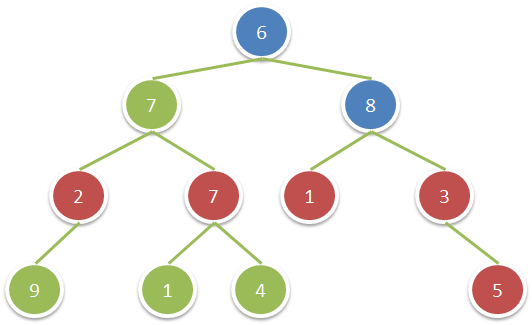

# 祖父节点值为偶数的节点和


>  [1315. 祖父节点值为偶数的节点和](https://leetcode.cn/problems/sum-of-nodes-with-even-valued-grandparent/)

图中`红色节点`的祖父节点的值为偶数，`蓝色节点`为这些红色节点的祖父节点



- 遍历一遍二叉树，**对于节点值为偶数的节点，累加它的孙子节点的值**
- ==不要想着==一定传参数祖父节点
	- `function traverse(root, grandFather) {`

```javascript
var sumEvenGrandparent = function (root) {
    let res = 0;
    const isEven = (num) => num % 2 === 0;
    function traverse(root) {
        if (!root) return;
        if (isEven(root.val)) {
            res += root?.left?.left?.val || 0;
            res += root?.left?.right?.val || 0;
            res += root?.right?.left?.val || 0;
            res += root?.right?.right?.val || 0;
        }
        traverse(root.left);
        traverse(root.right);
    }
    traverse(root);
    return res;
};
```