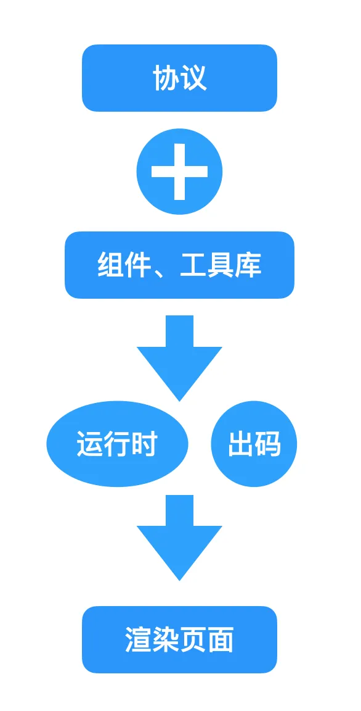
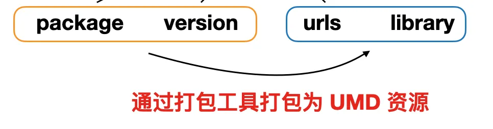
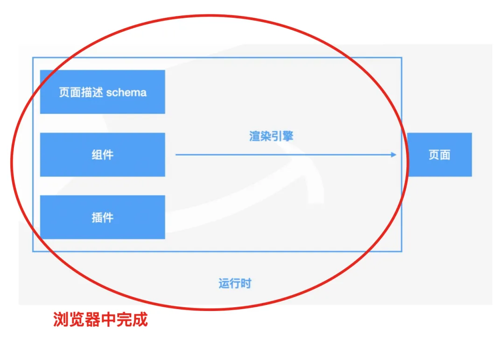
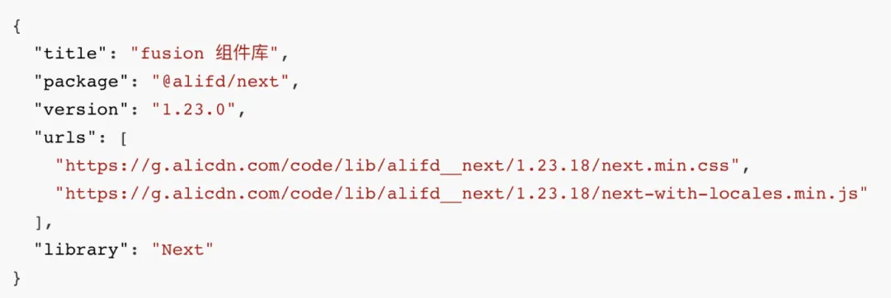
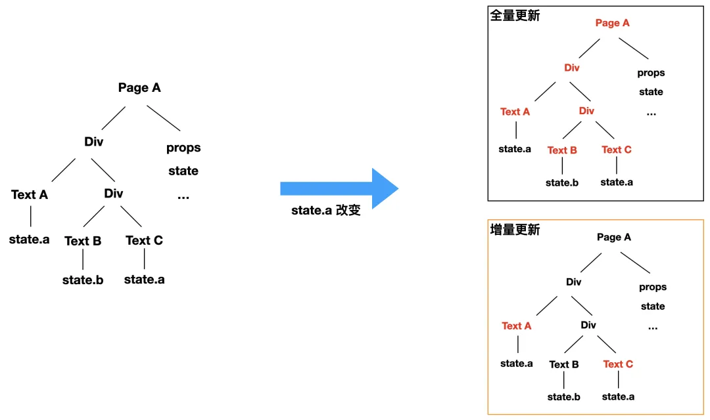
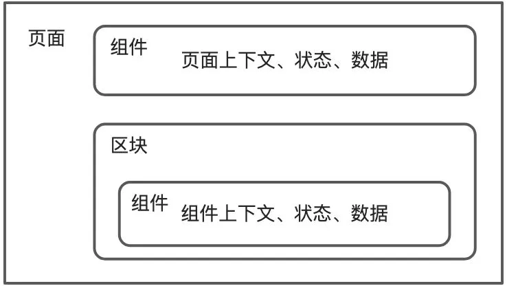
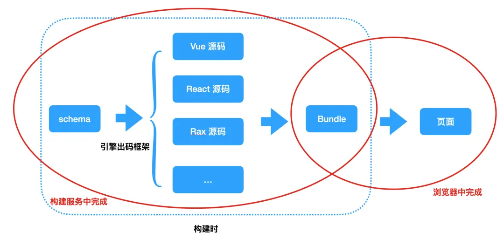
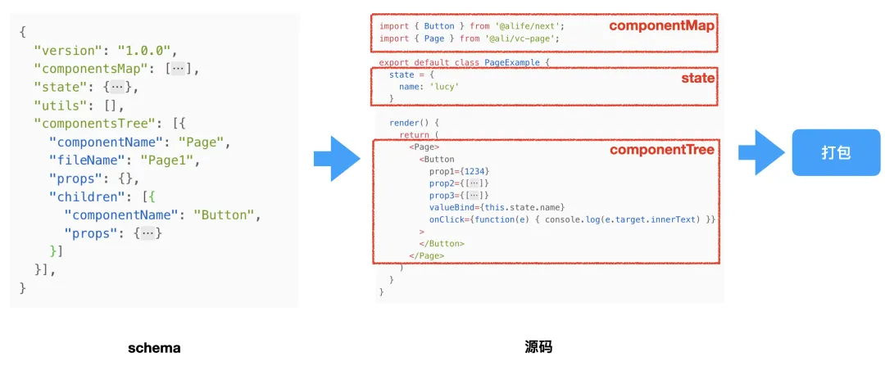

# 调研：低代码渲染设计思路

`#lowcode` 

## 目录
<!-- toc -->
 ## 1. JSON Schema 协议 

**低代码渲染引擎**将 `json` 渲染到浏览器中

- 低代码渲染都按照这一份标准来做
	- 不同部门、团队、公司低代码解析都是一致的
	- 这样各类物料、产物就可**无障碍流通**了

所以，**协议标准**非常重要

- 组件的来源
	- 产物放在 `urls` 字段 ，包括 `js/css`等，使用 `unpkg`
		- 需要打包成 `UMD` 资源
		- 

所以，这里要求类似于 `unpkg` 的打包方式
- 平台提供管理后台，提供详细的管理各类包管理方式，比如查看，删除包（不推荐），更新覆盖，清除缓存
	- 内部自己搭建的 `minio`： https://github.com/minio/minio
- 可参考 `unpkg` ，但内部已经有 `minio` 了

## 2. 运行时渲染

页面 `schema` 渲染成页面**都是在浏览器中完成的，不存在预编译的过程**，如下图：

比如我们要渲染的一个页面，可以把它解析成一个树状结构，而其中的最底层的节点就是**我们最小粒度的组件**。
- 对于这个**组件**，我们需要支持的能力主要是：  
	- 获取源码组件  
	- 解析组件的 `props`  
	- 获取组件的 `children`  
	- 保留并传入**上下文**，包括循环上下文，插槽上下文等;  
	- 节点更新，当参数变化时需要更新对应的节点  
	- 节点循环处理  
	- 获取节点实例并进行存储  
- 而比组件更大的一个纬度来说，也就是**页面的渲染**，而他们的能力需要：  
	-  页面生命周期的生成和执行；  
	- 页面内组件树描述生成，并递归处理单个组件；  
	- **页面上下文生成**，
		- 比如数据源 State、低代码组件的 Props 等。  
	- 页面 API 支持等

### 2.1. 组件渲染思路

#### 2.1.1. 获取组件源码，在 CDN 上

根据 Node 的 `componentName/type` 属性获取，有专门的`公共 utils` 来做这个事情，类似于下图

#### 2.1.2. 解析 JSON schema 拉取特定组件渲染

- 根据 type 拿到具体的 `lowcode` 组件后，本质是一个 **Vue 组件**，渲染该组件即可
- ID 字段：
	- ID 字段和 Type 字段可以保证唯一
	- ID 字段还会用于组件间互相调用
	- 如何生成呢？
		- 位置信息，每次拖入时，会给一个 id，保证配置的时候能够串起来
- 如果碰到 children 属性，说明需要**继续递归渲染**即可
- 每个组件都有特定的一些生命周期，需要做特定的事情，这个在规范里有体现
	- **初始化 onMounted**时，需要通过公共 `utils` 去拿该组件的数据流信息
		- 注意 ① ：**一个页面对应用一个 pinia**
			- 所以，我们对 pinia 做了很多公共方法的包装，方便初始化 pinia ，调用其他方法的数据
			- Pinia 本身设计高效，适度使用不会造成明显性能问题，但不建议为每个组件创建独立 store
				- 避免创建过多小而分散的 store
			- 所以，我们的做法是：`type = page`的页面统一维护 `store["page-${id}"]`
				- 挂在该页面下的组件 `State` 通过放在 `store["page-${id}"]` 下面的 `"${type}-${id}"` 字段来维护
					- 这要做的好处
						- ① 组件间交互调用就方便了，互相暴露各自的方法，统一处理 pinia
							- 事件流设计也依赖这个
							- 每个组件都有对外暴露的**事件表、动作表**
							- 以及组件树的互相引用 Ref
								- 都是能够互相拿到，比如 `getParent` 或者 `getChildren` 等等
								- 主要适用于，**写代码实现自定义事件流**
						- ② pinia 本身是响应式，避免了一个props 修改，导致整个组件树渲染
						- ③ 保证 `pinia` 内存占用说太高
		- 注意②：**预加载：**拉取相关的数据
			- 比如碰到 `init:url` ，就知道该页面需要哪些数据源
			- 如果组件也配置了 `init:url` ，那么到组件渲染时，会拉取数据，但是数据是挂在 `page-id` 下面的
	- 卸载时
		- 不要马上卸载 Store 里面的数据，保留最近 20 条页面，持久化到本地的
			- 比如使用 LRU 缓存算法
			- 为什么 20 条就够了
				- 一些复杂组件，很容易就一万条
				- localstrage 都很容易超了
		- 这样能保证切换页面时，马上能够马上渲染出来
- 这里没有说**数据流设计、和事件机制**，下面会展开

#### 2.1.3. 数据流设计

结合 `pinia` 和 `amis` 的数据域概念
- 本身 `pinia` 轻量，响应式，性能可控
- 最终存储的是：
	- `type=app`的协议
		- 里面不同页面存在 `pages字段里面` 里面
- 严格的 **store 设计**
	- global
		- 用户信息，主题，个人配置项目等等
		- 正常来讲，不推荐获取其他信息，**比如 url 参数，localstorge 的信息，都是推荐放到 global 里面**
		- 监听全局数据
	- app-id
		- 应用信息，配置信息，应用风格
		- 可监听全局数据
	- page-id
		- 页面的 schema 信息
		- 可互相监听数据
	- 组件
		- 可以获取上面的数据信息
		- 可互相监听，因为都是响应式数据
		- **特殊组件**可以使用自己的数据流命名空间： `com-id`
		- store 还有有个属性，type ，来区分 store的类型
			- global
			- app
			- page
			- com
			- 等等
	- 公共方法封装：
		- 数据交互，数据流很清晰
		- 封装很多方法，保证可以互相访问对应的 `Store` 数据
- 原理：
	- **本质是遍历协议 JSON 树** 
	- 根据不同类型，初始化数据
		- 比如遇到 `type = app` 
			- 需要初始化 app 信息
		- type = page
		- type = 具体组件时
		- `type = wujie` 
			- `subapp`
		- type= `iframe` ，完全使用iframe
		- `type= free` 
		- 等等

#### 2.1.4. 处理节点更新机制

当数据源变化的时候，我们需要对页面进行更新，主要有两种更新方式，**全量更新**和**增量更新。**

- **因为 pinia 数据源的响应性**，所以**天然能够做到增量更新，不会有全量更新的性能问题**
	- 阿里低代码和 amis 使用的 `mobx`，也是这个道理
- JSON 数据的 data 对应到 渲染时，都会转成 响应式数据，并且都会存到 pinia 中
- 至于组件自己的状态，组件实现就好了

### 2.2. 页面渲染

- store 存储的最小粒度，命名空间为 `page-id`，特殊组件除外
- 疑问❓
	- 那岂不是单独开发组件，不能独立于应用和页面？
		- 不是，因为 JSON schema 数据域的概念，自己配一个 `mock data url` 或者 data 字段就好
- 页面的生命周期：
	- 本质还是一个 Vue3 组件，使用 **Vue 的生命周期**，在特定时机做应该做的事情即可
	- JSON 配置的时候
		- 可添加 `onMouted` 等生命周期中添加：
			- 特定的自定义 JS 片段，然后就能够做特定周期能做的事情了
		- 但注意，一定是 `JS 字符串`
		- 这个很类似于 `Vue` 的 `Hooks` 执行逻辑
			- 生命周期钩子函数
- 页面上下文与应用上下文
	- 上下文、状态和数据管理可以考虑使用 `__proto__` 来实现的，类似于 **js 的原型链**
		- 
- 公共的方法会初始化到 `env` 对象中，任何地方都可以使用（app、page、组件）

### 2.3. 应用渲染思路

- 初始化应用相关的数据
	- 数据存储到 `store` 的 `app-id` 里面 
- menu
- 维度区分
	- 项目、app
		- menus / pages
			- 页面 `schema` 
- 后端存储数据的依据是 `schema` 

## 3. 出码渲染？

- 出码渲染：
	- 是将 `schema` 转化为 Vue 源码、React 源码或者其他语言的源码。
- 像 React 工程一样
	- 需要进行打包构建才能在浏览器中渲染一样，我们会将 React/其他源码进行打包，打包成一份 Bundle 文件，之后就可以在浏览器中进行消费，渲染出页面了
- 以上的过程大多数都是在**构建服务**中进行的，而 Bundle 渲染为页面是**在浏览器中**完成的，
	- 这一部分本身都是依赖市面上成熟的前端框架，比如 React、Vue 等，所以这时候**在浏览器的运行时已经不存在低代码渲染**了。
	- **所以：相对于运行时渲染而已，性能相对会好一些**

但是，这一步本质是**编译的工作更重些**，参考阿里低代码引擎的设计思路，下图：

- **个人认为，这一步的性价比得评估一下，阿里这样的大厂可以考虑，小公司就别想了**
- 如果运行时真的很慢
	- 可以考虑使用**模块联邦**的方式，直接拉取异步组件渲染，
	- 但这样不好的地方在于，不能配置了，完全属于 `Pro Code`

### 3.1. 未来呢，需要出码吗

理论上将，将 JSON DSL 转成 Vue 工程，这条路本身就是通的

**所以先做运行时，如果未来真有这场景，在做不迟**

产品业务层面要考虑的事情，技术侧是能够实现的
- 分析了，工业领域，移动端场景：
	- 完全不一样的业务场景，完全做两个版本即可

为什么移动端和 PC 要分开，这是因为：
- 业务场景本来就是分开的，两端都需要展示相对较少

## 4. 参考

- https://mp.weixin.qq.com/s/yqYey76qLGYPfDtpGkVFfA 
- amis 
- 阿里低代码引擎
