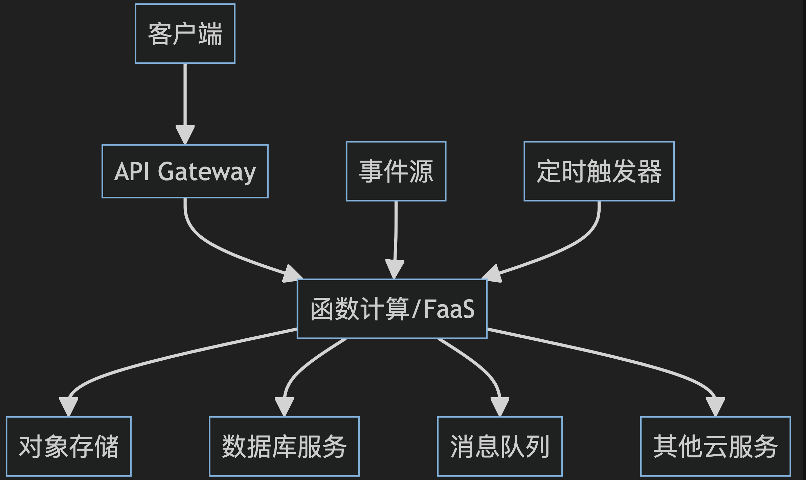
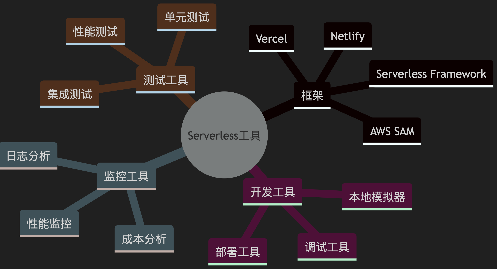
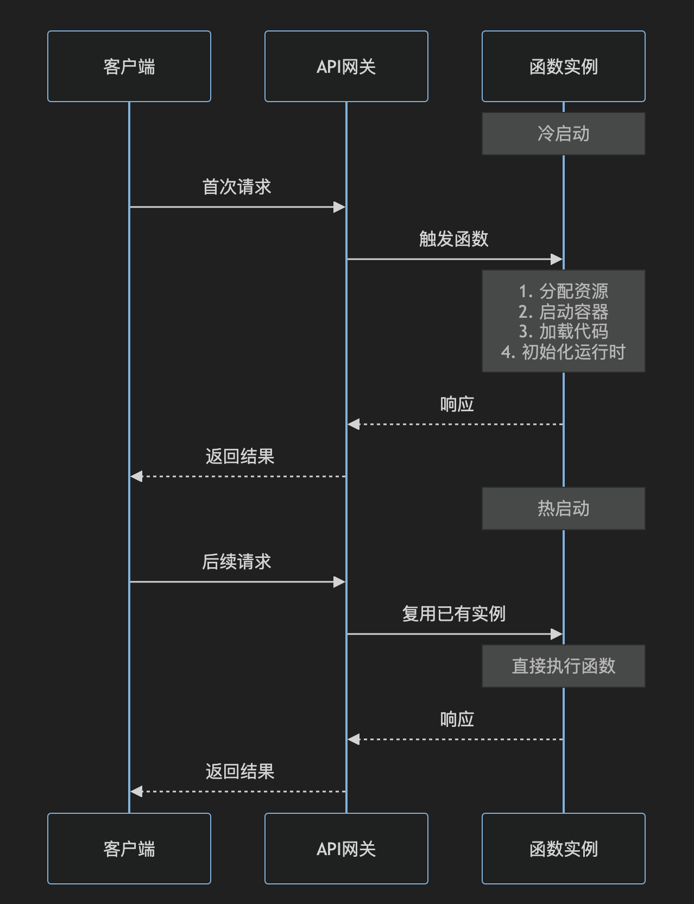

# Serverless（无服务器计算）

`#前端架构` 


## 目录
<!-- toc -->
 ## 总结 

- 无需关心服务器基础设施，由云服务商维护
- 实际使用量计费
- 主要优势
	- 降低运维成本
		- 无需管理服务器
		- 自动扩缩容
		- 降低人力成本
	- 成本优化
		- 按使用量付费
		- 无需为`闲置资源`付费
		- 更精确的资源利用
	- 开发效率
		- 专注`业务逻辑`
		- 快速部署
		- 天然的`微服务架构`
- 注意点
	- ==①== 冷启动问题
		- 环境准备：分配计算资源、启动容器&运行时&加载运行环境等
		- 代码准备
			- 下载代码 → 解压代码 → 安装依赖
		- 运行时：
			- 代码执行，数据库链接等等
	- ==②== 供应商锁定
		- 解决方案：抽象层

## 1. Serverless 介绍

### 1.1. **Serverless 的本质**

- 无需关心服务器基础设施，由云服务商维护
- 按实际使用计费（Pay as you go）：
	- 只在需要时运行，按实际使用量计费
- 自动弹性伸缩：
	- 根据负载自动扩展或收缩资源
- **事件驱动架构**，通常基于事件触发执行
- **FaaS（Function as a Service）+ BaaS（Backend as a Service）的结合**
	- **FaaS (Function as a Service)**
		- AWS Lambda
		- Azure Functions
		- Google Cloud Functions
		- 阿里云函数计算
	- **BaaS（Backend as a Service）**
		- 数据库服务（如 DynamoDB）
		- 身份认证服务
		- 消息队列服务
		- 对象存储服务

### 1.2. 2024年 Serverless 发展趋势

1. **AI 集成增强**
    - Serverless 平台正在深度集成 AI 能力
    - 支持 AI 模型的部署和推理
    - 提供 AI 相关的预构建函数 
2. **流处理和实时数据**
    - Serverless 流处理架构日益普及
    - 支持实时数据分析和处理
    - 事件驱动架构的深度整合
3. **混合云部署**
    - 支持跨云平台部署
    - 统一的管理和监控能力
    - 更灵活的资源调度

### 1.3. **主要优势**

- 降低运维成本
	- 无需管理服务器
	- 自动扩缩容
	- 降低人力成本
- 成本优化
	- 按使用量付费
	- 无需为`闲置资源`付费
	- 更精确的资源利用
- 开发效率
	- 专注`业务逻辑`
	- 快速部署
	- 天然的`微服务架构`

### 1.4. **常见应用场景**

   - 事件触发处理
     - 文件上传处理
     - 消息队列处理
     - WebHook 处理
   - Web 应用
     - API 接口服务
     - SSR（服务端渲染）
     - 静态网站托管
     - 用户认证授权
   - 定时任务
     - 数据同步
     - 定时备份
     - 报表生成
   - 实时数据处理
     - 日志处理
     - IoT 数据处理
	     - 设备控制命令下发
     - 流数据分析

### 1.5. **技术架构**



1. 功能解耦，保持函数单一职责
    - 合理设计触发器
    - 注意冷启动优化
    - 使用合适的状态管理策略
2. **开发流程**
    - 采用基础设施即代码（IaC）
    - 完善的测试策略
    - 本地开发环境模拟
    - 监控和日志体系建设
3. **性能优化**
    - 合理设置内存和超时时间
    - 利用缓存减少冷启动
    - 代码包大小优化
    - 并发控制

### 1.6. **主流服务商对比**

   
| 服务商 | 产品名称 | 特点 |
|-------|---------|------|
| AWS | Lambda | 最成熟、生态最完善 |
| 阿里云 | 函数计算 | 国内完善、集成度高 |
| 腾讯云 | 云函数 | 性价比高、本土化服务 |
| Google | Cloud Functions | 全球化、AI集成好 |
| Azure | Functions | 企业级服务完善 |

### 1.7. **开发最佳实践**

   - 函数设计
     - 单一职责原则
     - 控制执行时间
     - 合理设计触发器
     - 合理使用内存
     - 注意`冷启动`优化
   - 状态管理
     - 使用**外部存储**保存状态
     - 缓存合理利用
     - 注意数据一致性
   - 监控告警
     - 完善的日志记录
     - 性能监控
     - 错误追踪
     - 成本监控

### 1.8. **常见挑战和解决方案**

   - 开发体验问题：
	   - 本地开发和调试困难
   - **冷启动**问题
     - 预热机制
     - 代码优化
     - 合理设置内存
     - **后面会详细介绍**
   - 本地开发调试
     - 使用模拟器
     - 本地测试框架
     - 完善的开发工具
   - **供应商锁定风险**：vendor lock-in 
     - 抽象化设计
     - 标准化接口
     - 多云架构设计
 - **安全性**
    - 权限最小化原则
    - 安全策略配置
    - 数据加密传输
    - 审计日志完善

### 1.9. 前端开发者的 Serverless 实践

1. **前端集成**
    - API 网关集成
    - 静态资源部署
    - 身份认证
    - 前端`构建流程`
2. **开发工具**
    - Serverless Framework
    - AWS SAM
    - Vercel
    - Netlify
3. **最佳实践**
    - 合理的 API 设计
    - 错误处理机制
    - 性能监控
    - 安全防护

### 1.10. **前端视角的 Serverless**

   - SSR 应用
     ```typescript
     // Next.js Serverless 函数示例
     export async function getServerSideProps(context) {
       const data = await fetchData();
       return {
         props: { data }
       };
     }
     ```
   - API 路由
     ```typescript
     // Vercel Serverless 函数示例
     export default async function handler(req, res) {
       if (req.method === 'POST') {
         const data = await processData(req.body);
         res.status(200).json(data);
       }
     }
     ```

### 1.11. **未来趋势**

   - Edge Computing 集成
   - `WebAssembly` 支持
   - 更好的开发体验
   - 混合云架构
   - 更低的延迟
   - 更强的计算能力

### 1.12. **成本优化建议**

- 合理设置超时时间
- 优化函数执行效率
- 使用缓存减少调用
- 选择合适的内存配置
- 监控成本支出

### 1.13. **工具生态**



- Serverless 是云计算发展的重要方向，它能够帮助团队更专注于业务开发，提高开发效率，优化资源使用。
- 但在采用 Serverless 架构时，需要充分考虑其特点和限制，选择合适的场景，做好相应的优化和规划。
- 随着技术的发展和生态的完善，Serverless 的应用场景会越来越广泛，值得团队持续关注和实践。

## 2. `冷启动`

让我详细解释一下冷启动（Cold Start）的概念：

> 即`首次启动` 

### 2.1. 什么是冷启动？

冷启动是指 Serverless 函数在完全"冷"的状态下（即`首次运行或长时间未运行`）被调用时，需要经历的初始化过程。这个过程包括：

- **环境准备**
	- 分配计算资源
	- 启动容器/运行时
	- 加载运行环境（如 Node.js、Python 等）
- **代码加载**
	- 下载函数代码
	- 解压代码包
	- 加载依赖项
- **运行时初始化**
	- 执行全局代码
	- 建立数据库连接
	- 初始化外部服务客户端

### 2.2. 冷启动 vs 热启动

- **冷启动（Cold Start）**
	- 函数完全从零开始初始化
	- 耗时较长（可能几百毫秒到几秒）
	- 发生在首次调用或长时间未使用时
- **热启动（Warm Start）**
	- 复用已有的运行环境
	- 响应速度快（通常在毫秒级）
	- 发生在短时间内的重复调用

例如：


### 2.3. 冷启动的影响因素

- **运行时环境**
	- Node.js 通常启动较快
	- Java、.NET 等启动较慢
	- Python、Go 介于中间
- **代码包大小**
	- 代码包越大，加载时间越长
	- 依赖项数量影响初始化时间
- **初始化逻辑**
	- 数据库连接建立
	- 外部服务客户端初始化
	- 配置加载

### 2.4. 优化冷启动的策略

#### 2.4.1. **代码层面优化**

   ```javascript hl:10
   // 不推荐
   function handler(event) {
     // 每次调用都初始化
     const db = new Database();
     const client = new APIClient();
     // ...
   }

   // 推荐
   // 全局初始化，可以在热启动时复用
   const db = new Database();
   const client = new APIClient();
   
   function handler(event) {
     // 直接使用已初始化的连接
     // ...
   }
   ```

#### 2.4.2. **保持函数活跃**

- 使用`定时器定期调用函数`
- `预热关键路径`的函数
- 使用`预留并`发（如 AWS Lambda 提供的功能）

#### 2.4.3. **优化依赖**

- 精简依赖包
- 使用轻量级库
- 按需加载模块

#### 2.4.4. **架构优化**

- 使用`连接池`
- `缓存`频繁访问的数据
- 合理设置`超时时间`

### 2.5. 实际影响

假设一个典型的 Web API 场景：

- **正常情况（热启动）**
	- API 响应时间：~100ms
	- 用户体验良好
- **冷启动情况**
	- Node.js：额外 300-500ms
	- Python：额外 500-800ms
	- Java：额外 1-3秒
	- 用户可能感知到明显延迟

### 2.6. 监控和分析

- **关键指标**
	- 初始化时间
	- 执行时间
	- 冷启动频率
- **监控工具**
	- 云平台自带的监控
	- 自定义日志分析
	- APM 工具

### 2.7. 使用建议

- **评估业务需求**
	- 对响应时间敏感的接口需要特别关注
	- 考虑是否需要预留并发
	- 权衡成本和性能
- **测试策略**
	- 模拟冷启动场景
	- 压力测试
	- 性能基准测试
- **应对方案**
	- 关键接口使用预留并发
	- 非关键接口接受适度冷启动
	- 实施监控和告警机制

冷启动是 Serverless 架构中的一个重要考虑因素，通过合理的设计和优化，可以将其影响降到最低。对于大多数应用来说，冷启动的影响是可以接受的，特别是考虑到 Serverless 带来的其他优势（如成本效益、自动扩展等）。

## 3. Vendor Lock-in（供应商锁定）

Vendor Lock-in（供应商锁定）是云计算领域一个重要的概念，让我详细解释一下：

### 3.1. 什么是 Vendor Lock-in？

Vendor Lock-in 指的是用户（通常是企业）过度依赖特定供应商的产品或服务，导致无法轻易切换到其他供应商的情况。在 Serverless 环境中，这种情况尤为明显。

### 3.2. Serverless 中的 Vendor Lock-in 表现

#### 3.2.1. **专有服务依赖**

```javascript
// AWS 专有服务示例
const AWS = require('aws-sdk');
const dynamodb = new AWS.DynamoDB();
const s3 = new AWS.S3();

// 深度绑定 AWS 服务
async function handleUser(userId) {
    await dynamodb.putItem({
        TableName: 'Users',
        Item: { /* ... */ }
    }).promise();
    
    await s3.putObject({
        Bucket: 'user-files',
        Key: `${userId}/profile`,
        Body: data
    }).promise();
}
```

#### 3.2.2. **专有 API 格式**

```javascript
// AWS Lambda 特定的处理器格式
exports.handler = async (event, context) => {
    // AWS 特定的事件格式
    const records = event.Records;
    // ...
}

// Azure Functions 的格式则完全不同
module.exports = async function (context, myTimer) {
    // Azure 特定的上下文和触发器
    // ...
};
```

### 3.3. Vendor Lock-in 的影响

- **迁移困难**
	- 代码重写
	- 架构调整
	- 数据迁移
	- 运维流程变更
- **成本影响**
	- 难以议价
	- 被动接受价格调整
	- 迁移成本高
- **技术限制**
	- 受限于供应商的技术栈
	- 创新受限
	- 性能优化受限

### 3.4. 如何降低 Vendor Lock-in 风险

#### 3.4.1. **抽象层设计**

````JavaScript

  // 定义通用接口
  interface StorageService {
    save(key: string, data: any): Promise<void>;
    get(key: string): Promise<any>;
    delete(key: string): Promise<void>;
  }

  // AWS S3 实现
  class S3StorageService implements StorageService {
    private s3: AWS.S3;

    constructor() {
      this.s3 = new AWS.S3();
    }

    async save(key: string, data: any): Promise<void> {
      await this.s3.putObject({
        Bucket: 'my-bucket',
        Key: key,
        Body: data
      }).promise();
    }
    // ... 其他方法实现
  }

  // Azure Blob 实现
  class AzureStorageService implements StorageService {
    private blobService: azure.BlobService;

    constructor() {
      this.blobService = azure.createBlobService();
    }

    async save(key: string, data: any): Promise<void> {
      await this.blobService.createBlockBlobFromText(
        'my-container',
        key,
        data
      );
    }
    // ... 其他方法实现
  }

  // 业务代码使用接口，不直接依赖具体实现
  class UserService {
    constructor(private storage: StorageService) {}

    async saveUserProfile(userId: string, data: any) {
      await this.storage.save(`users/${userId}`, data);
    }
  }
````

#### 3.4.2. **使用标准化技术**

- 使用开源技术栈
- 采用容器化部署
- 遵循云原生标准

#### 3.4.3. **多云策略**

   ```yaml
   # 使用 Serverless Framework 支持多云部署
   service: my-service

   provider:
     name: ${opt:provider, 'aws'} # 可切换云供应商
     runtime: nodejs14.x

   functions:
     hello:
       handler: handler.hello
       events:
         - http:
             path: hello
             method: get
   ```

#### 3.4.4. **数据管理策略**

- 使用标准数据格式
- 定期数据备份
- 保持数据可移植性

### 3.5. 实际案例分析

#### 3.5.1. **高耦合场景**

```javascript
// 强依赖 AWS 服务的代码
const AWS = require('aws-sdk');
const lambda = new AWS.Lambda();
const dynamodb = new AWS.DynamoDB();
const sns = new AWS.SNS();

async function processOrder(order) {
    // 直接使用 AWS 服务
    await dynamodb.putItem({ /* ... */ });
    await lambda.invoke({ /* ... */ });
    await sns.publish({ /* ... */ });
}
```

#### 3.5.2. **低耦合方案**

```javascript
// 使用适配器模式
class MessageQueue {
    constructor(provider) {
        this.provider = provider;
    }

    async publish(message) {
        return this.provider.sendMessage(message);
    }
}

class AWSProvider {
    async sendMessage(message) {
        const sns = new AWS.SNS();
        return sns.publish({
            TopicArn: process.env.TOPIC_ARN,
            Message: message
        }).promise();
    }
}

class GCPProvider {
    async sendMessage(message) {
        const pubsub = new PubSub();
        const topic = pubsub.topic(process.env.TOPIC_NAME);
        return topic.publish(Buffer.from(message));
    }
}
```

### 3.6. 预防措施清单

- **架构设计**
	- 模块化设计
	- 使用依赖注入
	- 接口抽象
	- 配置外部化
- **技术选择**
	- 优先使用**标准协议**
	- 选择开源解决方案
	- 避免使用专有API
- **开发实践**
	- 编写可移植代码
	- 使用配置管理
	- 保持文档完善
- **运维策略**
	- 自动化部署脚本
	- 统一的监控方案
	- 备份和恢复计划

### 3.7. 评估和决策

在选择云服务时，需要考虑：

- **业务需求**
	- 功能需求
	- 性能要求
	- 成本预算
- **风险评估**
	- 供应商稳定性
	- 迁移难度
	- 长期成本
- **平衡取舍**
	- 开发效率
	- 维护成本
	- 技术灵活性
