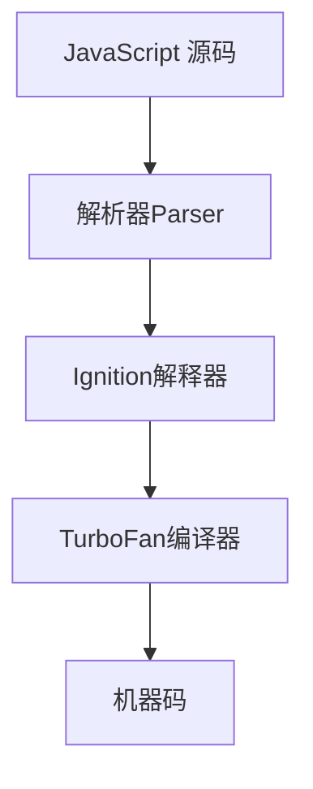
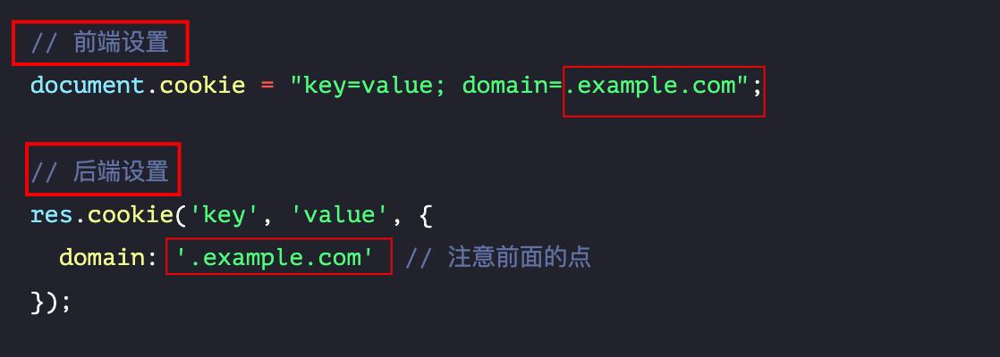
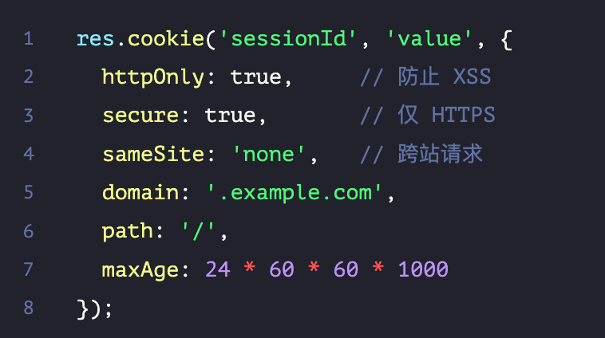

# 常见面试题：篇六

`#前端面试` 


## 目录
<!-- toc -->
 ## 1. IndexedDB 的存储空间限制 

- 不同浏览器有不同额限制
- Chrome 通常是设备可用空间的一定比例（约 80%）
	-  **单个源（Origin）的限制通常是可用空间的 20%**
- 可通过 `navigator.storage.estimate` 来查看和管理
- 用户也可以设置

## 2. 常用的 Webpack 插件

- HtmlWebpackPlugin
	- 自动生成 HTML 文件
	- 自动注入打包后的 JS 和 CSS
	- 支持 HTML 模板
	- 可以压缩 HTML 代码
- MiniCssExtractPlugin
	- 将 CSS 提取到单独的文件
	- 支持 CSS 按需加载
	- 避免闪烁
- CssMinimizerWebpackPlugin
	- 压缩 css
- CopyWebpackPlugin
	- 复制文件

## 3. QPS 达到峰值如何处理

> 扩容、限流、降级等

- 扩容
- 网关层：限流&降级
	- 限流逻辑
	- **降级策略**
		- 非核心服务自动降级
		- 返回降级页面或缓存数据
		- 保证核心功能可用
- **灾备方案**
    - 准备备用系统
    - 数据定期备份
    - 应急预案演练
- **修改客户端缓存时间**
- 静态资源放 cdn

## 4. js 超过最大值会怎么样 → Infinity

```javascript
let result = Number.MAX_VALUE * 2;
console.log(result);  // Infinity

let result2 = 1.8e308;
console.log(result2);  // Infinity
```

> 解决方案：使用 BigInt

## 5. 什么是领域模型？

领域模型就是把**现实世界中的业务概念和规则，用代码的方式表达出来**。
- 它就像是把真实世界的一部分"搬"到了软件中。

想象你要开发一个图书馆管理系统：
- **现实世界中有：**
	- 书籍
	- 读者
	- 借阅记录
	- 图书管理员
- **对应的领域模型就是：**
	- Book（书籍）类：包含书名、作者、ISBN等信息
	- Reader（读者）类：包含姓名、借书证号等信息
	- BorrowRecord（借阅记录）类：记录谁借了什么书
	- Librarian（管理员）类：负责处理借还书操作

**为什么需要领域模型？**
- **便于理解**：
	- 它帮助开发人员和业务人员更容易理解系统要做什么 
- **统一语言**：
	- 让所有人（包括开发者和业务人员）都用相同的术语交流，避免误解 
- **维护方便**：
	- 当业务规则改变时，知道应该修改哪部分代码


领域模型就像是给软件画的一幅"地图"，告诉我们：
- 系统里有什么重要的东西
- 这些东西之间是什么关系
- 它们应该遵守什么规则

就像我们在玩游戏时，**游戏中的角色、物品、任务等都是游戏世界的领域模型**
- 它们有自己的属性和规则，共同组成了一个完整的游戏世界。

## 6. 本地存储中设置数据失效时间的方法

- 原理：
	- 在存储数据时，**同时存储一个时间戳**，每次读取时检查是否过期。
- 注意事项
	- **数据大小限制**
		- `localStorage` 通常有 **5-10MB** 的限制
		- 存储大量数据时要考虑性能影响
	- **安全性考虑**
		- 不要存储敏感信息
		- 可以考虑对数据进行加密
	- 检查是否支持 `localStorage`
		- try-catch 
		- !!window.localStrage
	- 定期清理

## 7. 防止他人移除水印的技术方案

水印实现原理

```javascript
class Watermark {
    constructor(text = '公司机密') {
        // 1. 创建 Canvas 生成水印图案
        const canvas = document.createElement('canvas');
        const ctx = canvas.getContext('2d');
        ctx.rotate(-30 * Math.PI / 180);
        ctx.fillStyle = 'rgba(0, 0, 0, 0.1)';
        ctx.fillText(text, 50, 50);
        
        // 2. 创建固定定位的容器
        const div = document.createElement('div');
        Object.assign(div.style, {
            position: 'fixed',
            top: '0',
            left: '0',
            width: '100%',
            height: '100%',
            pointerEvents: 'none',
            zIndex: '9999',
            background: `url(${canvas.toDataURL()}) repeat`
        });
        
        document.body.appendChild(div);
    }
}
```

防篡改示例代码：

```javascript hl:5,1,15,10
// 1. 使用 MutationObserver 监听 DOM 变化
const observer = new MutationObserver(() => {
    if (!document.querySelector('.watermark')) {
        // 水印被删除，重新添加
        new Watermark();
    }
});

// 2. 定时检查水印状态
setInterval(() => {
    const watermark = document.querySelector('.watermark');
    if (!watermark || 
        getComputedStyle(watermark).opacity === '0' ||
        getComputedStyle(watermark).display === 'none') {
        new Watermark();
    }
}, 1000);
```

这是最核心的实现原理：
1. 用 `Canvas` 生成水印图案
2. 创建固定定位的 div 覆盖整个页面
3. 通过 `MutationObserver` 和`定时器`双重监控**防止篡改**
	- 或者检测不让打开控制台
		- F12 监听
		- 窗口大小监听
		- 检测到开发者工具，采取相应措施，提示错误页面
		- 禁用右键菜单
		- 加密水印

> 注意：没有完全无法破解的方案，但这种方式可以防止普通用户的篡改操作。

## 8. V8 引擎中的 JIT (Just-In-Time) 编译器的工作原理：

### 8.1. JIT 基本概念

JIT 是一种**在运行时将代码编译成机器码**的技术。V8 使用了**多层 JIT 编译策略**：




核心要点：
- V8 使用**多层 JIT 编译策略**
	- 解析器：
		- 将其转换为 AST（抽象语法树）和字节码。
	- Ignition 解释器：
		- 生成和执行字节码
	- TurboFan 编译器：
		- 负责将**热点代码**优化成`机器码`
		- 比如频繁调用 - 快速路径
			- for 循环的代码
	- 优化
		- 通过`隐藏类和内联缓存`等技术优化性能
		- ==类型改变==会触发去优化

## 9. Vue 中 Scoped Styles 的实现原理

总结： 
- 编译时的转换，**为每个组件生成唯一的属性选择器**，从而实现了样式的模块化和隔离
	- `[data-v-f3f3eg9]` 
- 优缺点
	-  优点
		- 避免样式冲突，明确样式作用范围等
	- 缺点
		- 性能开销、调试困难
- 特殊情况
	- 深度选择器 (:deep)
	-  插槽内容

>  主要还是编译的工作

## 10. 网站防止爬虫的主要策略和方法

- 技术层面防护
	- 请求频率限制
	-  User-Agent 检测
	- IP 限制
- 验证机制
	-  验证码实现
	- Cookie 验证
- 数据保护
	- 动态数据加载
	- 数据加密
	- 蜜罐技术：`<a href="/trap" style="display: none;">Hidden Link</a>`
- 前端防护
	- 禁用右键和复制
	- 动态渲染
- 服务器配置
	-  robots.txt 
- 监控和响应
	- 访问日志
	- 实施监控
- 合规
	- 隐私法规
	- 用户协议

## 11. 介绍几种通知用户刷新页面的方案

- Service Worker 方案
	- 这是最现代和推荐的方案，可以在后台检测新版本并通知用户。
- WebSocket 方案
	- 通过 `WebSocket` 实时推送更新通知。
- 轮询检测方案
	- 定期检查版本号来确定是否需要更新。
- 构建时注入版本号方案
	- 在 webpack 构建时注入版本号，并在运行时检查。

## 12. 几种检测网页空闲状态的方法：

- 基础事件监听方案 → 遍历监听相关的事件信息
	- 最基本的方法是**监听用户交互事件来重置计时器**。
-  Page Visibility API 方案 + 遍历监听相关的事件信息
	- 结合**页面可见性 API 实现更精确的空闲检测**。
- 使用 `requestAnimationFrame` 优化性能

## 13. 几种防止他人调试前端代码的方法

> 需要注意的是，这些方法**不能完全**阻止专业人员的调试，但可以**增加调试难度**，防止一般用户查看和修改代码。

- 禁用开发者工具
	- 即禁止禁用 F12、Ctrl+Shift+I、Ctrl+Shift+J、Ctrl+U 
	- 检查页面宽高
	- 即使打开了， 
		- `console.clear()`; // 清空控制台
		- 打开新的页面等等，就让他调不了
-  代码混淆和加密
- 控制台检测和清理&覆盖 console 等
- 调试器检测
- 源代码保护
	- 完整防护方案
		- 多种方法一起


## 14. 需要在跨域请求中携带另外一个域名下的 Cookie 该如何操作?

> 如何在跨域请求中携带 Cookie，这需要前后端都进行相应的配置。

- 前端配置
	- fetch
		- credentials: 'include',  
	- Axios
		- withCredentials ： true
	- XMLHttpRequest
		- `xhr.withCredentials = true;`
- 后端配置 (Node.js)
	- Express
	- Koa
	- 都是设置corsOptions 为 `credentials:true`
- 其他
	- 子域名共享 Cookie
		- 
	- 处理 OPTIONS **预检请求**
	- Access-Control-Allow-Origin 不要设置为 `*
	- 合理设置 Cookie 属性
		- 
	- 验证请求来源 origin


