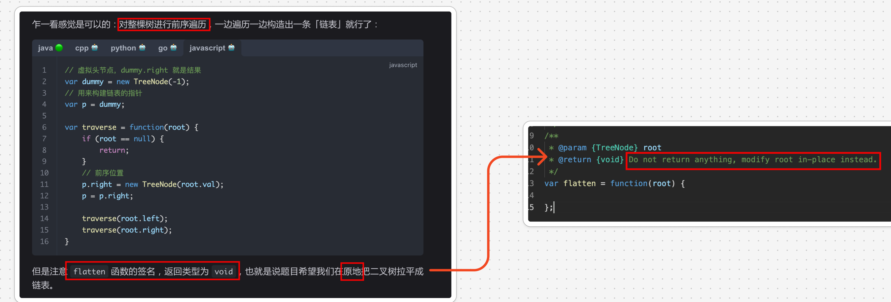
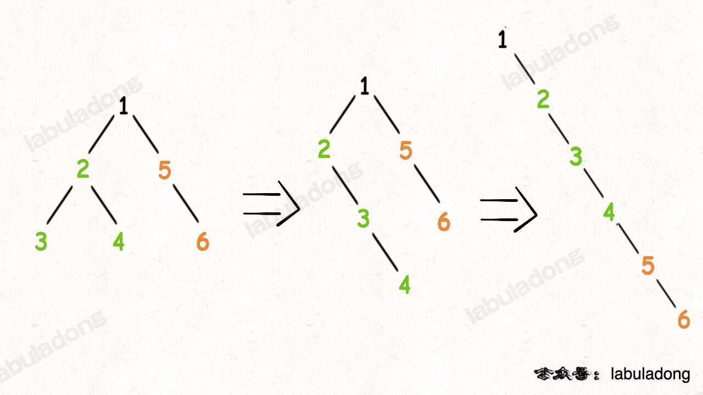
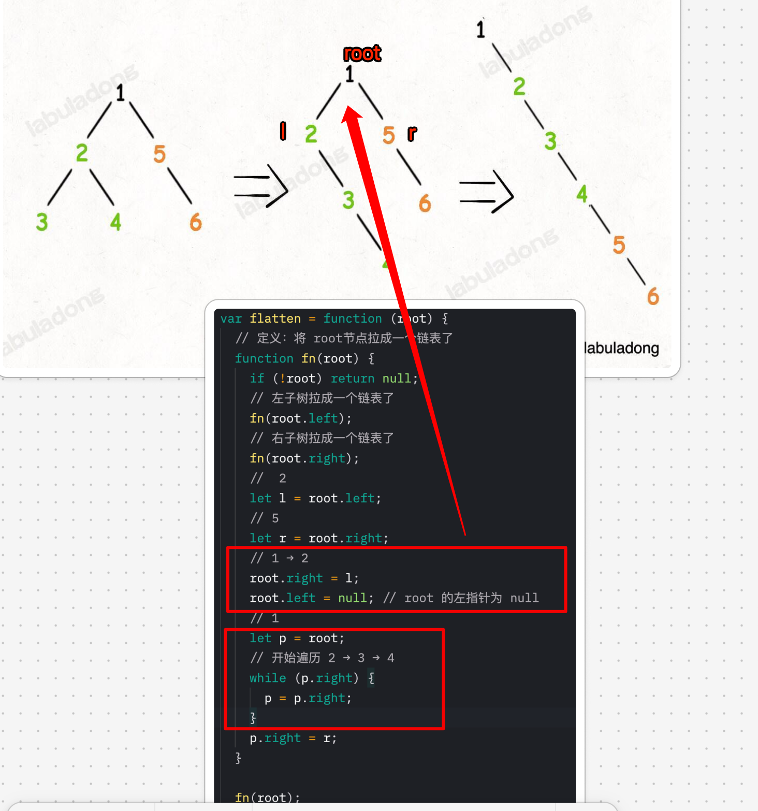

# 二叉树展开为链表

`#二叉树`  `#算法/二叉树` 

>  [114. 二叉树展开为链表](https://leetcode.cn/problems/flatten-binary-tree-to-linked-list/)


## 目录
<!-- toc -->
 ## 1. 总结 

- 使用**分解**问题的思路
- 画图画图，画图就知道了，不然写不出来的
- `let p = root;` 指向根节点
	- 类似于单链表指向 head，即 **head 对应 root**
	- `while(p.next)`

```javascript
/**
 * @param {TreeNode} root
 * @return {void} Do not return anything, modify root in-place instead.
 */
var flatten = function (root) {
  // 定义：将 root节点拉成一个链表了
  function fn(root) {
    if (!root) return null;
    // 左子树拉成一个链表了
    fn(root.left);
    // 右子树拉成一个链表了
    fn(root.right);
    //  2
    let l = root.left;
    // 5
    let r = root.right;
    // 1 → 2
    root.right = l;
    root.left = null; // root 的左指针为 null
    // 1
    let p = root;
    // 开始遍历 2 → 3 → 4
    while (p.right) {
      p = p.right;
    }
    p.right = r;
  }
  fn(root);
};
```

## 2. 重点：不能使用遍历的思路



## 3. 分解问题的思路



> 关键是这张图这张图



### 3.1. 定义：`flatten(root)` 将 root 节点拉平