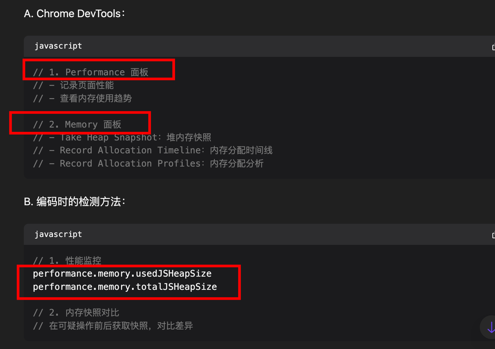
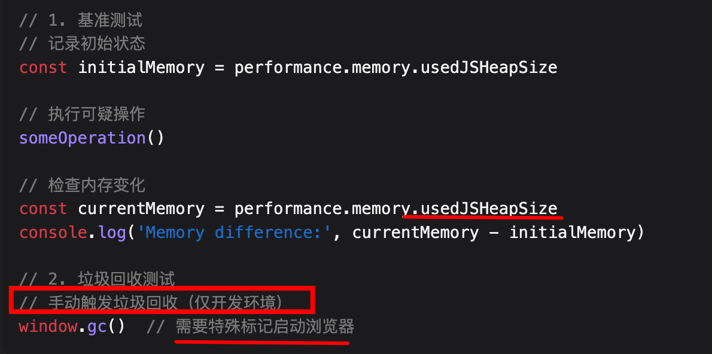

# 浏览器中如何查找内存泄漏

- 内存泄漏是指程序中已分配的内存由于某些原因无法被正常释放。
- 在前端开发中，常见的内存泄漏场景包括未清除的事件监听器、定时器、闭包引用等。
- 我们可以通过 
	- Chrome DevTools 的 Memory 面板来检测内存泄漏
		- 
	- 编码检测
		- 
- 在实际项目中，我会特别注意在组件卸载时清理副作用，使用 WeakMap/WeakSet 来处理缓存，避免闭包滥用。同时，我们团队也建立了完整的**性能监控体系**，包括自动化的内存泄漏检测