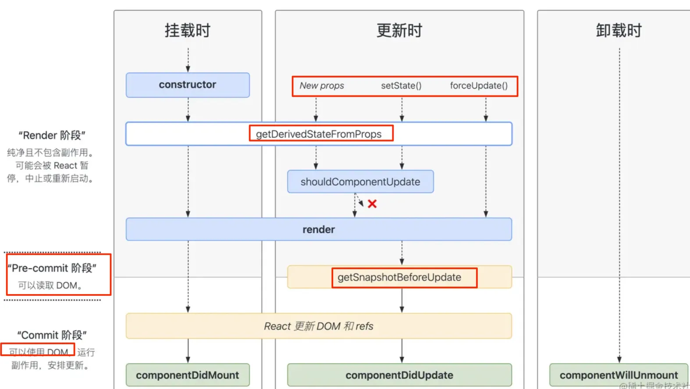
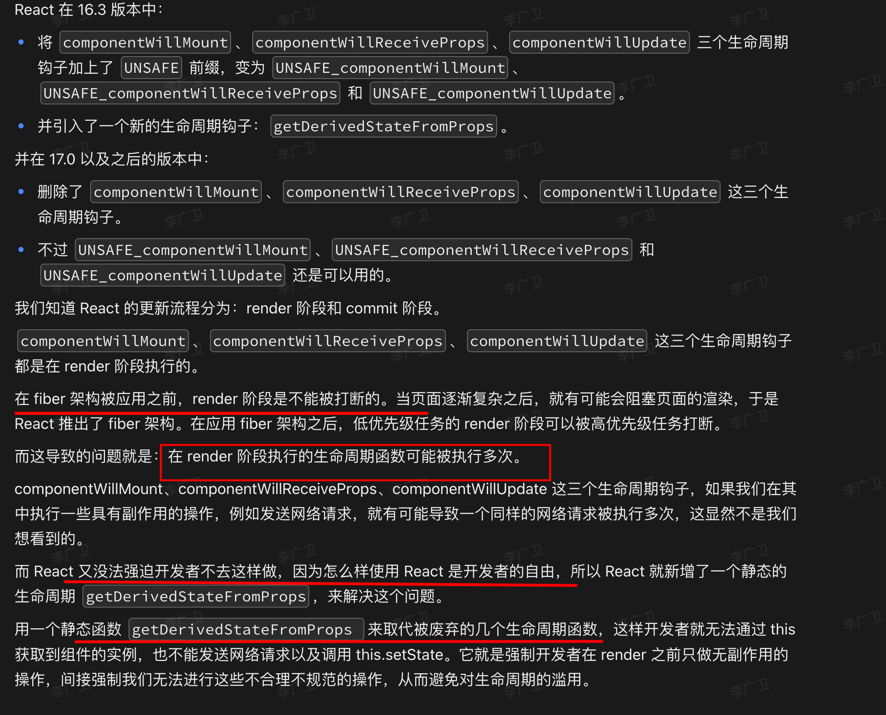

# React Class 类生命周期如何对应 Hooks


## 目录
<!-- toc -->
 ## 1. 总结 

- Class 组件 ==<=>== Hooks 等效实现

```javascript
// Class 组件              Hooks 等效实现
// ------------------------------------------
// constructor              -> useState, useRef
// getDerivedStateFromProps -> useEffect 配合 useState
// shouldComponentUpdate    -> React.memo
// render                   -> 函数本身
// componentDidMount        -> useEffect([])
// componentDidUpdate       -> useEffect([deps])
// componentWillUnmount     -> useEffect 返回的清理函数
// componentDidCatch        -> 需要使用 Class 组件
// getSnapshotBeforeUpdate  -> 没有直接等效实现

```

- getDerivedStateFromError 与 componentDidCatch 区别
	 - getDerivedStateFromError 在`渲染阶段`调用，是==同步==的
	- 用于==降级 UI，容错==
	 - componentDidCatch 在`提交阶段`调用，可以执行副作用
	 - `getDerivedStateFromError` 必须返回一个`状态对象`
	 - `getDerivedStateFromError` 支持**服务端渲染**，而 `componentDidCatch` 不支持 
- Class组件的生命周期，分==五个阶段==
	- 初始化 + 挂载阶段 + 组件更新 + 卸载 + 错误处理
- React 为什么要废弃 `componentwillMount`、`componentWillReceiveProps`、`componentWillUpdate` `
	- 在`fiber`中，==render 可被打断==，**可能在 wilMount 中获取到的元素状态很可能与实际需要的不同
	- ==一句话就是，Render 阶段可能会被打断，那么 willxxx 就可以执行多次==

## 2. 先说Class组件的生命周期

分四个阶段：组件挂载阶段 + 组件更新 + 卸载 + 错误处理阶段 ，如下图：



### 2.1. 第一阶段：组件挂载阶段

挂载阶段组件被创建，然后组件实例插入到 DOM 中，完成组件的第一次渲染，在此阶段`会依次调用`以下这些方法
- `constructor`：初始化组件的 `state`，给事件处理方法绑定 `this`
- `getDerivedStateFromProps`，静态方法，它存在只有一个目的：**让组件在 props 变化时更新 state**。
	- 该方法返回一个对象用于更新 `state`，如果返回 `null` 则不更新任何内容
- `render`：根据状态 `state` 和属性 `props` 渲染组件。
	- **这个函数只做一件事，就是返回需要渲染的内容，不要在这里面做其他事情**
- `componentDidMount`：代表`组件挂载完成`， 在这里可以DOM操作、网络请求、事件订阅等
	- 其实`不推荐直接在componentDidMount直接调用setState`，因为我们又调用了一次`setState`，就会在未来再进行一次`render`，造成不必要的性能浪费，**大多数情况可以设置初始值来搞定**

#### 2.1.1. 代码详细示例

下面是详细使用示例：
1. constructor
2. static getDerivedStateFromProps
3. render
4. componentDidMount

```jsx hl:2,15,34,44
class MyComponent extends React.Component {
  // 1. constructor
  constructor(props) {
    super(props);
    this.state = {
      count: 0
    };
    // 用途：
    // - 初始化 state
    // - 绑定事件处理器
    // - 不应该在这里调用 setState
    // - 不应该产生副作用
  }

  // 2. static getDerivedStateFromProps
  static getDerivedStateFromProps(props, state) {
    // 参数：
    // - props: 新的属性
    // - state: 当前状态
    // 返回值：返回一个对象来更新 state，或者返回 null 表示不更新
    // 用途：
    // - 根据 props 更新 state
    // - 是静态方法，不能访问 this
    // - 应该是纯函数，不应该产生副作用
    if (props.count !== state.prevCount) {
      return {
        count: props.count,
        prevCount: props.count
      };
    }
    return null;
  }

  // 3. render
  render() {
    // 用途：
    // - 返回要渲染的内容
    // - 必须是纯函数
    // - 不能调用 setState
    // - 不能直接与浏览器交互
    return <div>{this.state.count}</div>;
  }

  // 4. componentDidMount
  componentDidMount() {
    // 用途：
    // - 发起网络请求
    // - 添加订阅
    // - 操作 DOM
    // - 设置定时器
    fetch('api/data')
      .then(response => response.json())
      .then(data => this.setState({ data }));
  }
}
```

### 2.2. 第二阶段：组件更新阶段

- `getDerivedStateFromProps`，如上
- `shouldComponentUpdate(nextProps, nextState)` 是否应该渲染组件 
	- `性能优化的点`
- `render`，如上
- `getSnapshotBeforeUpdate(prevProps, prevState)`
	- 在 `render` 之后，`componentDidUpdate` 之前调用
	- 最近一次渲染输出（提交到 DOM 节点）之前调用。即` React更新DOM或Refs之前调用 `
	- 返回值作为第三个参数传给`componentDidUpdate`
- `componentDidUpdate(prevProps, prevState, snapshot){}` ，更新后立即被调用，通常做以下操作
	- 当组件更新后，对`DOM 进行操作`；
	- 参数
		- snapshot: getSnapshotBeforeUpdate 的返回值
		- prevProps: 更新前的属性
	    - prevState: 更新前的状态
	- 如果你对更新前后的 `props` 进行了比较，也可以选择在此处进行`网络请求`；
		- （例如，当 `props` 未发生变化时，则不会执行网络请求）

#### 2.2.1. 代码详细示例

1. static getDerivedStateFromProps
2. shouldComponentUpdate
3. render
4. getSnapshotBeforeUpdate
5. componentDidUpdate

```jsx hl:10,25,38
class MyComponent extends React.Component {
  // 1. static getDerivedStateFromProps
  // 同上，每次更新也会调用

  // 2. shouldComponentUpdate
  shouldComponentUpdate(nextProps, nextState) {
    // 参数：
    // - nextProps: 新的属性
    // - nextState: 新的状态
    // 返回值：true 表示需要更新，false 表示不更新
    // 用途：
    // - 性能优化
    // - 控制组件是否需要重新渲染
    return this.props.value !== nextProps.value;
  }

  // 3. render
  // 同上

  // 4. getSnapshotBeforeUpdate
  getSnapshotBeforeUpdate(prevProps, prevState) {
    // 参数：
    // - prevProps: 更新前的属性
    // - prevState: 更新前的状态
    // 返回值：传递给 componentDidUpdate 的第三个参数
    // 用途：
    // - 在 DOM 更新之前获取一些信息
    // - 例如：滚动位置
    const list = this.listRef.current;
    return list.scrollHeight - list.scrollTop;
  }

  // 5. componentDidUpdate
  componentDidUpdate(prevProps, prevState, snapshot) {
    // 参数：
    // - prevProps: 更新前的属性
    // - prevState: 更新前的状态
    // - snapshot: getSnapshotBeforeUpdate 的返回值
    // 用途：
    // - 对 DOM 进行操作
    // - 网络请求
    // - 注意：调用 setState 需要有条件，否则会无限循环
    if (this.props.userID !== prevProps.userID) {
      this.fetchData(this.props.userID);
    }
  }
}
```

### 2.3. 第三阶段：组件卸载阶段

- componentWillUnmount
	- 清除 `timer`，取消网络请求或清除
	- 取消在 `componentDidMount()` 中创建的订阅等；

#### 2.3.1. 代码详细示例

```jsx
class MyComponent extends React.Component {
  // componentWillUnmount
  componentWillUnmount() {
    // 用途：
    // - 清理工作
    // - 取消网络请求
    // - 清除订阅
    // - 清除定时器
    this.subscription.unsubscribe();
    clearInterval(this.timer);
  }
}
```

### 2.4. 第四阶段：错误处理阶段

- getDerivedStateFromError，**后代组件抛出错误后被调用**，**发生在渲染阶段**
	- 返回值：返回一个对象来更新 state
	- 用途：
		- **在渲染错误页面之前更新 state** ，==用于容错==
		- 不应该产生副作用
- `componentDidCatch(error, info)`
	- 参数：
		- error: 错误对象
		- errorInfo: 包含 `componentStack` 信息的对象
	- 用途：
		- 错误日志记录
		- 可以产生副作用

#### 2.4.1. 代码详细示例

```jsx hl:10
class MyComponent extends React.Component {
  // static getDerivedStateFromError
  static getDerivedStateFromError(error) {
    // 参数：
    // - error: 错误对象
    // 返回值：返回一个对象来更新 state
    // 用途：
    // - 在渲染错误页面之前更新 state
    // - 不应该产生副作用
    return { hasError: true };
  }

  // componentDidCatch
  componentDidCatch(error, errorInfo) {
    // 参数：
    // - error: 错误对象
    // - errorInfo: 包含 componentStack 信息的对象
    // 用途：
    // - 错误日志记录
    // - 可以产生副作用
    logErrorToService(error, errorInfo);
  }
}
```

### 2.5. 完整的生命周期示例

```jsx
class CompleteLifecycleComponent extends React.Component {
  constructor(props) {
    super(props);
    this.state = {
      count: 0,
      data: null,
      error: null
    };
    this.listRef = React.createRef();
  }

  static getDerivedStateFromProps(props, state) {
    if (props.count !== state.prevCount) {
      return {
        count: props.count,
        prevCount: props.count
      };
    }
    return null;
  }

  componentDidMount() {
    // 初始化数据获取
    this.fetchData();
    // 设置定时器
    this.timer = setInterval(this.tick, 1000);
    // 添加事件监听
    window.addEventListener('resize', this.handleResize);
  }

  shouldComponentUpdate(nextProps, nextState) {
    // 性能优化
    return (
      this.props.count !== nextProps.count ||
      this.state.data !== nextState.data
    );
  }

  getSnapshotBeforeUpdate(prevProps, prevState) {
    if (prevState.data !== this.state.data) {
      const list = this.listRef.current;
      return list.scrollHeight - list.scrollTop;
    }
    return null;
  }

  componentDidUpdate(prevProps, prevState, snapshot) {
    // 处理数据变化
    if (this.props.dataId !== prevProps.dataId) {
      this.fetchData();
    }

    // 使用 snapshot
    if (snapshot !== null) {
      const list = this.listRef.current;
      list.scrollTop = list.scrollHeight - snapshot;
    }
  }

  componentWillUnmount() {
    // 清理工作
    clearInterval(this.timer);
    window.removeEventListener('resize', this.handleResize);
    this.cancelPendingRequests();
  }

  static getDerivedStateFromError(error) {
    return { error: error };
  }

  componentDidCatch(error, errorInfo) {
    // 错误日志记录
    logErrorToService(error, errorInfo);
  }

  // 自定义方法
  fetchData = async () => {
    try {
      const response = await fetch(`api/data/${this.props.dataId}`);
      const data = await response.json();
      this.setState({ data });
    } catch (error) {
      this.setState({ error });
    }
  };

  handleResize = () => {
    // 处理窗口大小变化
  };

  tick = () => {
    this.setState(state => ({ count: state.count + 1 }));
  };

  render() {
    if (this.state.error) {
      return <ErrorDisplay error={this.state.error} />;
    }

    return (
      <div ref={this.listRef}>
        <h1>Count: {this.state.count}</h1>
        <DataDisplay data={this.state.data} />
      </div>
    );
  }
}
```

### 2.6. 注意点与总结

- **不是所有方法都需要使用**：
	- 大多数情况下只需要 `constructor`、`render` 和 `componentDidMount`
	- 其他方法用于特定场景的优化或处理
- **避免常见错误**：
	- 不要在 `constructor` 和 `render` 中调用 `setState`
	- 在 `componentDidUpdate` 中调用 `setState` 需要条件判断
	- 清理工作要在 `componentWillUnmount` 中完成
- **性能考虑**：
	- 使用 `shouldComponentUpdate` 优化性能
	- 避免在 `render` 中进行复杂计算
	- 注意内存泄漏问题
- **最佳实践**：
	- 保持生命周期方法简洁
	- 遵循单一职责原则
	- 适当使用错误边界
	- 正确处理异步操作
- 最后，还是多使用 Hooks 吧

## 3. React 16 废弃了那些生命周期函数

- `componentWillMount`：
	- 完全可以使用 `componentDidMount` 和 `constructor` 来代替
- `componentWillReceiveProps`
	- 来回比较数据状态不可预测行
	- 增加组件重回次数
	- 使用静态方法代替：`getDerivedStateFromProps`，不使用 `this`，纯函数，不会写出副作用代码
- `componentWillUpdate`：
	- 在`fiber`中，==render 可被打断==，**可能在wilMount中获取到的元素状态很可能与实际需要的不同**
	- 会触发多次
		- 比如，在这个生命周期中，`调用setState会造成死循环`，导致程序崩溃。

React 为什么要废弃 `componentwillMount`、`componentWillReceiveProps`、`componentWillUpdate` 这三个生命周期钩子？，它们有哪些问题呢？ React 又是如何解决的呢？



==一句话就是，Render 阶段可能会被打断，那么 willxxx 就可以执行多次==

## 4. getDerivedStateFromError vs componentDidCatch 以及 Hooks 中的错误处理

> 关于错误处理，更多 [23. React 中错误捕获的方式](/post/OJqKcyoi.html)

### 4.1. getDerivedStateFromError vs componentDidCatch

这两个生命周期方法都用于错误处理，但有重要区别：

```javascript hl:4,10
class ErrorBoundary extends React.Component {
  state = { hasError: false };

  // 用于渲染降级 UI
  static getDerivedStateFromError(error) {
    // 返回新的 state
    return { hasError: true };
  }

  // 用于错误日志记录
  componentDidCatch(error, errorInfo) {
    // 可以将错误日志发送到服务器
    logErrorToService(error, errorInfo);
  }

  render() {
    if (this.state.hasError) {
      return <h1>Something went wrong.</h1>;
    }
    return this.props.children;
  }
}
```

主要区别：
- getDerivedStateFromError 在`渲染阶段`调用，是==同步==的
	- 用于==降级 UI，容错==
- componentDidCatch 在`提交阶段`调用，可以执行副作用
- `getDerivedStateFromError` 必须返回一个`状态对象`
- `getDerivedStateFromError` 支持**服务端渲染**，而 `componentDidCatch` 不支持 

使用示例如下：

```javascript hl:1,18
// 创建错误边界组件
class ErrorBoundary extends React.Component {
  state = { 
    hasError: false,
    error: null,
    errorInfo: null 
  };

  static getDerivedStateFromError(error) {
    // 基础错误状态
    return { 
      hasError: true,
      error 
    };
  }

  componentDidCatch(error, errorInfo) {
    // 记录详细错误信息
    this.setState({
      errorInfo
    });
    
    // 发送到错误追踪服务
    logErrorToService(error, errorInfo);
  }

  render() {
    if (this.state.hasError) {
      return (
        <div className="error-ui">
          <h2>Something went wrong</h2>
          {process.env.NODE_ENV === 'development' && (
            <details>
              <summary>Error Details</summary>
              <pre>{this.state.error?.toString()}</pre>
              <pre>{this.state.errorInfo?.componentStack}</pre>
            </details>
          )}
          <button onClick={() => this.setState({ hasError: false })}>
            Try again
          </button>
        </div>
      );
    }

    return this.props.children;
  }
}
```

### 4.2. 在现代 React（Hooks）中的使用

虽然目前 Hooks 不能直接实现错误边界，但有几种推荐的解决方案：

#### 4.2.1. 使用第三方库 react-error-boundary

```javascript
import { ErrorBoundary } from 'react-error-boundary';

function ErrorFallback({error, resetErrorBoundary}) {
  return (
    <div role="alert">
      <p>Something went wrong:</p>
      <pre>{error.message}</pre>
      <button onClick={resetErrorBoundary}>Try again</button>
    </div>
  );
}

function MyApp() {
  return (
    <ErrorBoundary
      FallbackComponent={ErrorFallback}
      onReset={() => {
        // 重置应用状态
      }}
      onError={(error, errorInfo) => {
        // 记录错误
        logError(error, errorInfo);
      }}
    >
      <MyComponent />
    </ErrorBoundary>
  );
}
```

#### 4.2.2. 自定义 Hook 配合错误边界

```javascript
function useErrorHandler() {
  const [error, setError] = useState(null);

  useEffect(() => {
    if (error) {
      throw error; // 抛出错误给最近的错误边界
    }
  }, [error]);

  return setError;
}

function MyComponent() {
  const handleError = useErrorHandler();

  const handleClick = async () => {
    try {
      await riskyOperation();
    } catch (error) {
      handleError(error);
    }
  };

  return <button onClick={handleClick}>Risky Operation</button>;
}
```

### 4.3. 最佳实践和注意事项 

#### 4.3.1. 错误边界的粒度控制

```javascript
function App() {
  return (
    <ErrorBoundary>
      <Header />
      <ErrorBoundary>
        {/* 关键功能单独错误处理 */}
        <MainContent />
      </ErrorBoundary>
      <ErrorBoundary>
        {/* 非关键功能单独错误处理 */}
        <Sidebar />
      </ErrorBoundary>
      <Footer />
    </ErrorBoundary>
  );
}
```

#### 4.3.2. 错误恢复策略

```javascript
class ErrorBoundary extends React.Component {
  state = { hasError: false };

  static getDerivedStateFromError(error) {
    return { hasError: true };
  }

  resetError = () => {
    this.setState({ hasError: false });
    // 可能需要清除缓存或重新获取数据
    this.props.onReset?.();
  };

  render() {
    if (this.state.hasError) {
      return (
        <div>
          <h2>Something went wrong</h2>
          <button onClick={this.resetError}>
            Reset and try again
          </button>
        </div>
      );
    }
    return this.props.children;
  }
}
```

### 4.4. 需要注意的是

- 错误边界无法捕获以下错误：
	- 事件处理器中的错误
	- 异步代码错误
	- 服务端渲染错误
	- 错误边界组件自身的错误
- 在开发环境中，错误会冒泡到窗口，这是为了确保错误更容易被发现
- 在生产环境中，错误会被限制在错误边界内
- 建议在应用的不同层级设置错误边界，以实现更细粒度的错误处理

## 5. Class 和 Hooks 对应的生命周期

### 5.1. 初始化阶段

#### 5.1.1. Class 组件

```javascript
class MyComponent extends React.Component {
  constructor(props) {
    super(props);
    this.state = {
      count: 0
    };
  }
}
```

#### 5.1.2. Hooks 方式

```javascript
function MyComponent(props) {
  const [count, setCount] = useState(0);
  
  // 如果需要复杂的初始状态计算
  const [state, setState] = useState(() => {
    const initialState = someExpensiveComputation(props);
    return initialState;
  });
}
```

### 5.2. 挂载阶段

#### 5.2.1. Class 组件

```javascript
class MyComponent extends React.Component {
  componentDidMount() {
    console.log('组件已挂载');
    // 执行副作用，如 API 调用
    this.fetchData();
    // 添加事件监听
    window.addEventListener('resize', this.handleResize);
  }
}
```

#### 5.2.2. Hooks 方式：空依赖数组表示仅在挂载时执行

```javascript hl:14
function MyComponent() {
  useEffect(() => {
    console.log('组件已挂载');
    // 执行副作用
    fetchData();
    
    // 添加事件监听
    window.addEventListener('resize', handleResize);
    
    // 清理函数（相当于 componentWillUnmount）
    return () => {
      window.removeEventListener('resize', handleResize);
    };
  }, []); // 空依赖数组表示仅在挂载时执行
}
```

### 5.3. 更新阶段

#### 5.3.1. Class 组件

```javascript
class MyComponent extends React.Component {
  componentDidUpdate(prevProps, prevState) {
    if (this.props.userID !== prevProps.userID) {
      this.fetchData(this.props.userID);
    }
  }

  shouldComponentUpdate(nextProps, nextState) {
    return this.props.value !== nextProps.value;
  }
}
```

#### 5.3.2. Hooks 方式

```javascript
function MyComponent({ userID }) {
  // 替代 componentDidUpdate
  useEffect(() => {
    fetchData(userID);
  }, [userID]); // 仅在 userID 改变时执行

  // 替代 shouldComponentUpdate
  const MemoizedComponent = React.memo(MyComponent, (prevProps, nextProps) => {
    return prevProps.value === nextProps.value;
  });
}
```

### 5.4. 卸载阶段

#### 5.4.1. Class 组件

```javascript
class MyComponent extends React.Component {
  componentWillUnmount() {
    // 清理工作
    window.removeEventListener('resize', this.handleResize);
    this.clearIntervals();
  }
}
```

#### 5.4.2. Hooks 方式

```javascript hl:10
function MyComponent() {
  useEffect(() => {
    // 设置
    const interval = setInterval(() => {
      // 一些操作
    }, 1000);

    // 返回清理函数
    return () => {
      clearInterval(interval);
    };
  }, []);
}
```

### 5.5. 错误处理

#### 5.5.1. Class 组件

```javascript hl:2,6
class MyComponent extends React.Component {
  componentDidCatch(error, errorInfo) {
    logErrorToService(error, errorInfo);
  }

  static getDerivedStateFromError(error) {
    return { hasError: true };
  }
}
```

#### 5.5.2. Hooks 方式

```javascript
// 错误边界目前还需要使用 Class 组件
// 但可以创建自定义 Hook 处理组件内的错误
function useErrorHandler(error) {
  const [hasError, setHasError] = useState(false);
  
  useEffect(() => {
    if (error) {
      setHasError(true);
      logErrorToService(error);
    }
  }, [error]);

  return hasError;
}
```

### 5.6. 获取派生状态

#### 5.6.1. Class 组件

```javascript
class MyComponent extends React.Component {
  static getDerivedStateFromProps(props, state) {
    if (props.currentRow !== state.lastRow) {
      return {
        isScrollingDown: props.currentRow > state.lastRow,
        lastRow: props.currentRow
      };
    }
    return null;
  }
}
```

#### 5.6.2. Hooks 方式

```javascript
function MyComponent(props) {
  const [isScrollingDown, setIsScrollingDown] = useState(false);
  const [lastRow, setLastRow] = useState(0);

  // 使用 useEffect 模拟 getDerivedStateFromProps
  useEffect(() => {
    if (props.currentRow !== lastRow) {
      setIsScrollingDown(props.currentRow > lastRow);
      setLastRow(props.currentRow);
    }
  }, [props.currentRow, lastRow]);
}
```

### 5.7. 性能优化

#### 5.7.1. Class 组件

```javascript
class MyComponent extends React.Component {
  shouldComponentUpdate(nextProps, nextState) {
    return this.props.value !== nextProps.value;
  }
}
```

#### 5.7.2. Hooks 方式

```javascript
function MyComponent({ value }) {
  // 使用 useMemo 缓存计算结果
  const expensiveValue = useMemo(() => {
    return computeExpensiveValue(value);
  }, [value]);

  // 使用 useCallback 缓存函数
  const handleClick = useCallback(() => {
    doSomething(value);
  }, [value]);
}

// 使用 React.memo 进行组件级别的优化
const MemoizedComponent = React.memo(MyComponent);
```

### 5.8. 自定义生命周期 Hook

```javascript hl:12
// 组合多个生命周期的自定义 Hook
function useLifecycle(props) {
  // 模拟 componentDidMount
  useEffect(() => {
    console.log('组件已挂载');
    return () => console.log('组件将卸载');
  }, []);

  // 模拟 componentDidUpdate
  const prevPropsRef = useRef();
  useEffect(() => {
    if (prevPropsRef.current) {
      // 比较 props 变化
      const prevProps = prevPropsRef.current;
      // 执行更新后的操作
    }
    prevPropsRef.current = props;
  });

  // 返回需要的值或方法
  return {
    // ...
  };
}
```

### 5.9. Hooks 完整的生命周期示例

```javascript
function CompleteLifecycleComponent({ data }) {
  // 1. 构造函数阶段
  const [state, setState] = useState(() => {
    // 初始化状态
    return { data: processData(data) };
  });

  // 2. 挂载阶段
  useEffect(() => {
    console.log('组件已挂载');
    // 执行副作用
    const subscription = subscribeToData();

    // 3. 卸载阶段
    return () => {
      console.log('组件将卸载');
      subscription.unsubscribe();
    };
  }, []);

  // 4. 更新阶段
  useEffect(() => {
    console.log('数据已更新');
    updateUIWithData(data);
  }, [data]);

  // 5. 错误处理
  const [error, setError] = useState(null);
  useEffect(() => {
    if (error) {
      logError(error);
    }
  }, [error]);

  // 6. 性能优化
  const memoizedValue = useMemo(() => {
    return expensiveComputation(state.data);
  }, [state.data]);

  if (error) {
    return <ErrorDisplay error={error} />;
  }

  return (
    <div>{/* 渲染内容 */}</div>
  );
}
```

### 5.10. 生命周期方法对照表

```javascript
// Class 组件              Hooks 等效实现
// ------------------------------------------
// constructor              -> useState, useRef
// getDerivedStateFromProps -> useEffect 配合 useState
// shouldComponentUpdate    -> React.memo
// render                   -> 函数本身
// componentDidMount        -> useEffect([])
// componentDidUpdate       -> useEffect([deps])
// componentWillUnmount     -> useEffect 返回的清理函数
// componentDidCatch        -> 需要使用 Class 组件
// getSnapshotBeforeUpdate  -> 没有直接等效实现

```

