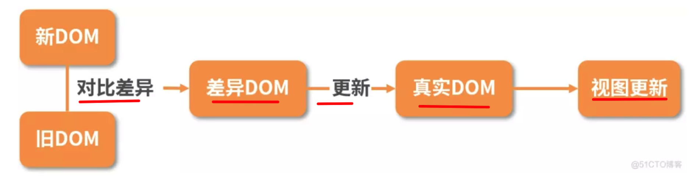
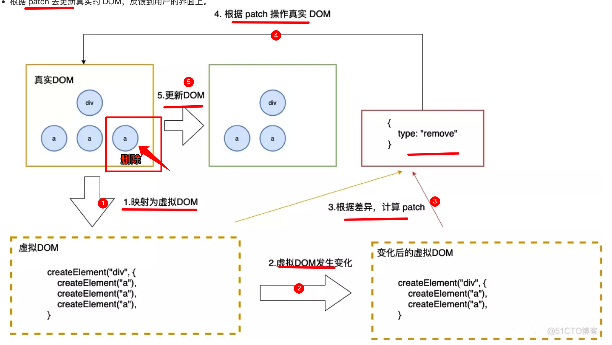
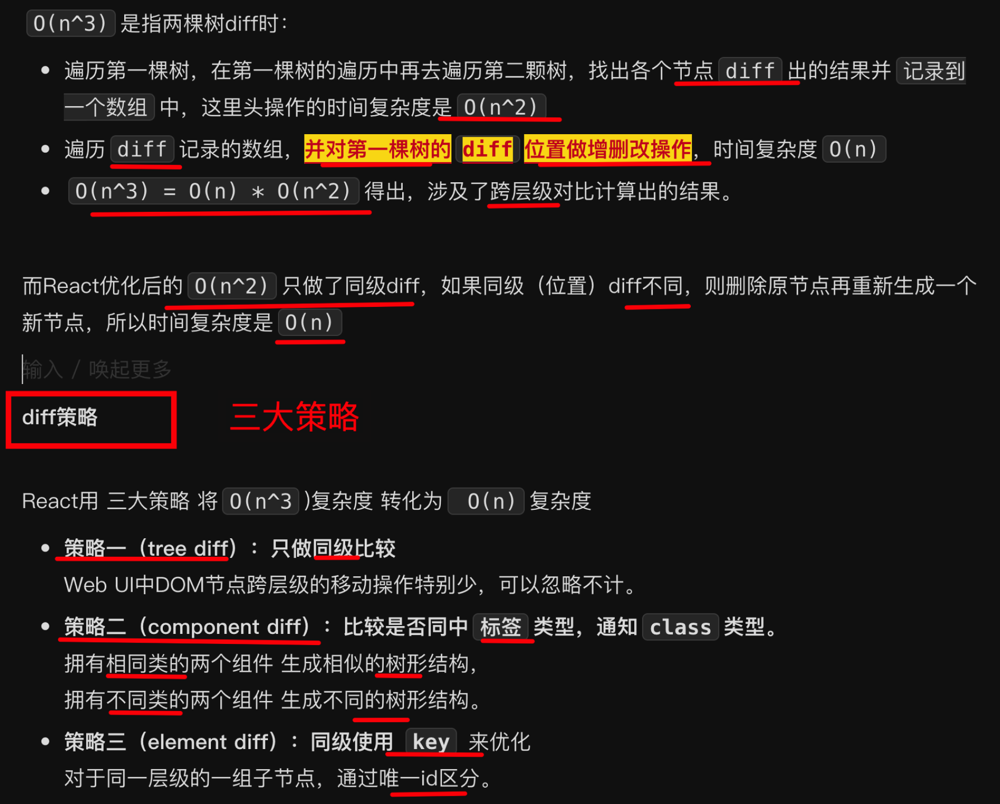
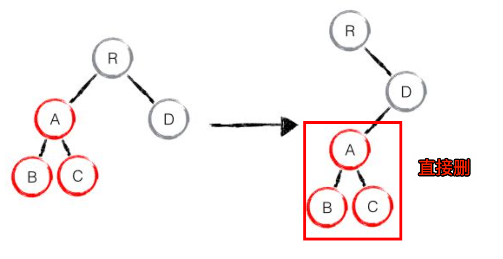
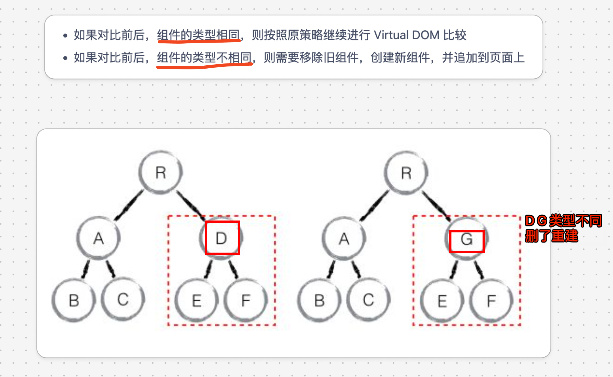
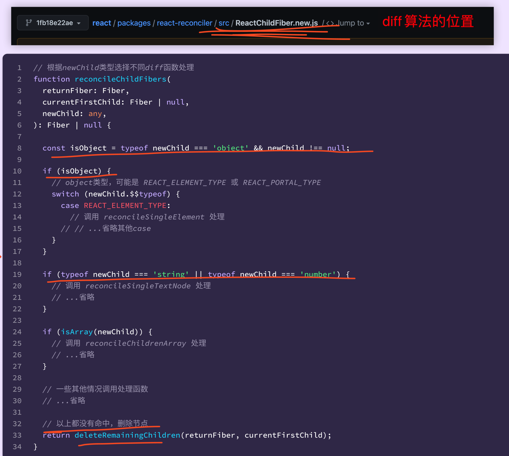

# React 的 Diff 算法

`#react` 


## 目录
<!-- toc -->
 ## 1. 总结 

- diff 算法的本质就是，对比 `current Filber` 与 JSX 生成 `workInProgress Fiber`
- 复杂度 O(n^3) → O(n^2) 
	- 只做统计比较
	- 只做类型比较
	- 同级使用 key
- 仅仅右移策略
	- 主要针对 **两个列表 Diff**
- 不同操作的优先级是不同的
	- 第一遍遍历
		- 先处理 **更新**
	- 第二遍遍历：
		- 处理不属于 `更新` 的节点，比如`新增`、`删除`

## 2. 基本流程



### 2.1. 示例 1：删除一个节点 `a`



### 2.2. 示例 2：`vdom` 到 `真实 DOM` 代码示例

```javascript
// 1. 构建虚拟DOM
var tree = el("div", { id: "container" }, [
  el("h1", { style: "color: blue" }, ["simple virtal dom"]),
  el("p", ["Hello, virtual-dom"]),
  el("ul", [el("li")]),
]);

// 2. 通过虚拟 DOM 构建真正的 DOM
var root = tree.render();
document.body.appendChild(root);

// 删除了一个 li 

// 3. 生成新的虚拟 DOM
var newTree = el("div", { id: "container" }, [
  el("h1", { style: "color: red" }, ["simple virtal dom"]),
  el("p", ["Hello, virtual-dom"]),
  el("ul", [el("li"), el("li")]),
]);

// 4. 比较两棵虚拟DOM树的不同
var patches = diff(tree, newTree);

// 5. 在真正的DOM元素上应用变更
patch(root, patches);
```

## 3. 复杂度为什么是O(n^3) 及 怎么做到 O(n^2) 的？



下面展开说说

### 3.1. 只做同级比较：tree diff

当出现节点`跨层级的移动`时，并不会出现想象中移动操作，而是`删了重建`，如下图：



> Web UI 中 DOM 节点跨层级的移动操作特别少，可以忽略不计

### 3.2. 只做类型比较：Component Diff



### 3.3. Element Diff：同级使用 `key`

- 在进行组件对比的时候，如果`两个组件类型相同`，则需要进行元素级别的对比，这叫做 `Element Diff`
- React 提出优化策略：允许开发者对同一层级的同组子节点，添加唯一 key 进行区分

#### 3.3.1. 示例

- newList：`['B', 'C', 'A', 'D']`
- oldList：`['A', 'B', 'C', 'D']`
- Diff 过程：
    - 所以 `lastIndex` 代表访问过的节点最大索引
    - 遍历 `newList`
    - 遍历到 `B`
        - 在 `oldList` 中查找相同的元素 `B` 的位置是 `1` 
            - 如果`当前节点在老集合中的位置`小于 `lastIndex `，说明需要移动
                - 而 `1 > 0` 所以不需要移动
            - 否则，不需要移动，更新 `lastIndex = 1`
        - 所以，'B' 位置变化：不需要移动（lastIndex = 1）
    - 'C' 位置变化：不需要移动（lastIndex = 2）
    - 'A' 发现需要移动：因为它的原始位置(0) 小于 lastIndex(2)
    - 'D' 位置不变：保持不动

#### 3.3.2. 完整代码如下

```javascript hl:6,10,37
// 简化版的 React Diff 算法中的移动逻辑
function updateChildren(oldList, newList) {
  // 记录访问过的节点最大索引
  let lastIndex = 0;

  // 遍历新的子元素
  for (let i = 0; i < newList.length; i++) {
    const newChild = newList[i];
    let found = false;
    // 在老的子元素中查找相同的元素
    for (let j = 0; j < oldList.length; j++) {
      const prevChild = oldList[j];

      // 找到相同的元素（通过 key 判断）
      if (newChild.key === prevChild.key) {
        found = true;

        // 如果当前节点在老集合中的位置小于最大索引，说明需要移动
        if (j < lastIndex) {
          // 需要移动
          // 在实际 DOM 操作中，将这个节点移动到当前位置
          move(prevChild, currentPosition);
        } else {
          // 不需要移动，更新 lastIndex
          lastIndex = j;
        }
        break;
      }
    }

    // 如果没找到，说明是新元素，需要插入
    if (!found) {
      insert(newChild, currentPosition);
    }
  }

  // 移除老集合中剩余的元素
  for (let i = 0; i < oldList.length; i++) {
    const prevChild = oldList[i];
    if (!newList.find((child) => child.key === prevChild.key)) {
      remove(prevChild);
    }
  }
}

```

#### 3.3.3. 算法分析

- 通过**限制移动方向**，简化了算法复杂度，即**仅右移**
- 虽然可能不是最优解，但是在大多数情况下都能得到不错的性能

#### 3.3.4. 注意点

1. 始终为列表项提供稳定的 key
2. 避免使用数组索引作为 key 

## 4. 源码中 Diff 算法位置



## 5. 一个简单的 Diff 算法

```javascript
const vnode = {
  tag: "div",
  props: { id: "app" },
  children: [
    { tag: "h1", props: {}, children: ["Hello World"] },
    {
      tag: "p",
      props: {},
      children: ["This is a simple React Diff implementation."],
    },
  ],
};

// 比较两个虚拟 DOM 节点
function diff(oldVNode, newVNode) {
  // 新增节点
  if (!oldVNode) {
    return newVNode;
  }
  // 删除节点
  if (!newVNode) {
    return null;
  }
  // 如果节点类型不同，直接替换成新节点
  if (oldVNode.tag !== newVNode.tag) {
    return newVNode; // 替换节点
  }
  // 比较属性
  const propDiff = diffProps(oldVNode.props, newVNode.props);
  
  // 递归比较子节点
  const childrenDiff = diffChildren(oldVNode.children, newVNode.children);

  // 返回新的虚拟 DOM 节点
  return { ...newVNode, propDiff, childrenDiff };
}

// 比较属性,返回属性的变化
function diffProps(oldProps, newProps) {
  // 比较属性的变化
  const changes = {};
  for (const key in newProps) {
    if (oldProps[key] !== newProps[key]) {
      changes[key] = newProps[key];
    }
  }
  return changes;
}

// 递归比较子节点，这里只比较了子节点的长度，没有比较子节点的内容
// 实际上还需要递归调用 diff 函数
function diffChildren(oldChildren, newChildren) {
  const diffs = [];
  const maxLength = Math.max(oldChildren.length, newChildren.length);
  for (let i = 0; i < maxLength; i++) {
    diffs.push(diff(oldChildren[i], newChildren[i]));
  }
  return diffs;
}

```

## 6. 不同操作的优先级是不同的

比如，`更新`组件发生频率较高，所以 Diff 算法优先会看当前节点是否属于`更新`，所以，
- 第一遍遍历：
	- 优先级看处理 `更新` 的节点
- 第二遍遍历：
	- 处理不属于 `更新` 的节点，比如`新增`、`删除`

## 7. 总结

- 完全对比 `O(n³)` 无法接受，故降级为同层对比的 `O(n)` 方案
	- 为什么降级可行？因为跨层级很少发生，可以忽略
- 同层级也不简单，难点是如何高效位移，即最小步数完成位移
	- React 采用`仅右移`方案，在大部分从左往右移的业务场景中，得到了较好的性能
- vue 为了尽量不移动，先左右夹击跳过不变的，再找到最长连续子串保持不动，移动其他元素