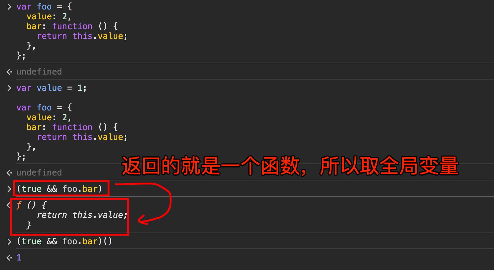
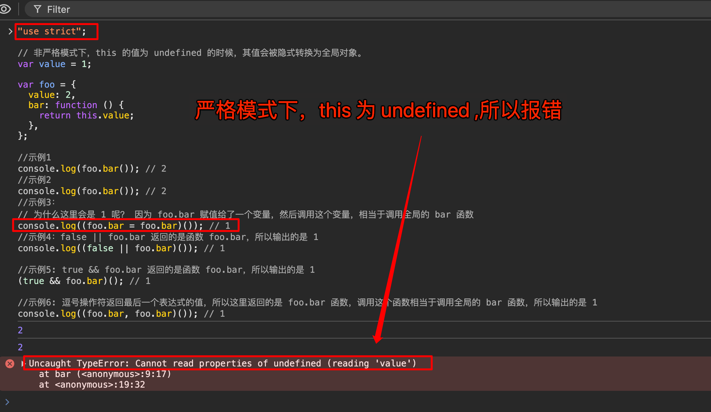

# this 指向问题汇总


## 目录
<!-- toc -->
 ## 1. this 指向问题  

总结：
- 箭头函数的 `this` 是**词法作用域**的 this，在定义时就确定了
- 普通函数的 `this` 是**动态**的，取决于调用方式
- 如果需要方法中的 `this` 指向**对象本身**，应该：
    1. 使用普通函数定义方法
    2. 或在**对象方法**内部定义箭头函数
    3. 或在类的**构造函数**中定义箭头函数

```javascript 
const obj = {
  fn1: () => {
    // this 指向定义时所在的对象，即 window
    // 如果 new 调用，则报错
    console.log(this);
  },
  fn2: function () {
    console.log("fn2", this);
  },
  fn2: function () {
    // 这里的箭头函数继承了 fn2 的 this
    const arrowFn = () => {
      console.log(this);
      // 这里的 this 会指向 obj
    };
    arrowFn();
  },
};

obj.fn1(); // Window {...}

// 因为还是在 obj.fn 下面调用
obj.fn2(); // { fn1: [Function: fn1], fn2: [Function: fn2] }

fn2 = obj.fn2;
// 这就是在 window 上面调用
fn2(); // Window {}

const x = new obj.fn1(); //  Uncaught TypeError: obj.fn1 is not a constructor
const y = new obj.fn2(); // fn2 {}
```

## 2. this 的问题

- 第 5 行**是在普通方法里面**

```javascript hl:5,8,14
var name = 123;
var obj = {
  name: 456,
  print: function () {
    // 这里的 this 指向 obj，作为对象的方法被调用
    console.log(this.name); // 456
    function a() {
      console.log(this.name); // 123
    }
    a();
  },
};

// 普通函数的 this 指向取决于在何处被调用，这里 a 函数是在全局作用域被调用的，所以 this 指向全局对象
obj.print(); // 123

```

> **a 函数是再全局作用域被调用的，因为它在 15 行调用的**

### 2.1. a 函数为什么打印出 123

这是因为函数 `a` 是作为==普通函数调用的，而不是作为对象的方法调用==。

1. **函数调用的位置决定 this**：

```javascript
var name = 123;
var obj = {
    name: 456,
    print: function() {
        console.log(this.name); // 456
        function a() {
            console.log(this.name); // 123
        }
        a(); // 关键在这里！这是一个普通函数调用
    }
};
```

在这个例子中：
- `obj.print()` 是作为对象方法调用，所以 `print` 函数中的 `this` 指向 `obj`
- 但内部函数 `a()` 是作为普通函数调用的，相当于直接调用 `a()`，此时 `this` 指向全局对象（非严格模式下）

2. **解决方案**：
如果想让内部函数 `a` 中的 `this` 也指向 `obj`，有几种方法：

```javascript
// 方法1：使用变量保存外部的 this
var obj = {
    name: 456,
    print: function() {
        var that = this; // 保存外部 this
        function a() {
            console.log(that.name); // 456
        }
        a();
    }
};

// 方法2：使用箭头函数
var obj = {
    name: 456,
    print: function() {
        const a = () => {
            console.log(this.name); // 456
        }
        a();
    }
};

// 方法3：使用 bind
var obj = {
    name: 456,
    print: function() {
        function a() {
            console.log(this.name); // 456
        }
        a.bind(this)();
    }
};
```

3. **为什么会这样？**
JavaScript 中的 this 绑定规则如下：

```javascript
// 1. 默认绑定（普通函数调用）
function foo() {
    console.log(this); // window
}
foo();

// 2. 隐式绑定（作为对象方法调用）
const obj = {
    foo: function() {
        console.log(this); // obj
    }
};
obj.foo();

// 3. 显式绑定（使用 call, apply, bind）
function foo() {
    console.log(this);
}
foo.call(obj); // obj

// 4. new 绑定
function Foo() {
    console.log(this); // Foo 实例
}
new Foo();
```

4. **this 绑定的优先级**：
```
new 绑定 > 显式绑定 > 隐式绑定 > 默认绑定
```

在你的例子中：
```javascript
var name = 123;
var obj = {
    name: 456,
    print: function() {
        function a() {
            // 这里是默认绑定，因为是普通函数调用
            console.log(this.name); // 123
        }
        a(); // 普通函数调用，this 指向全局对象
    }
};
```

这就是为什么内部函数 `a` 中的 `this.name` 会打印 `123` 而不是 `456` 的原因。

这是 JavaScript 中常见的一个"陷阱"，需要特别注意函数的调用方式来确定 `this` 的指向。

在实际开发中，为了避免这种问题：
1. 使用箭头函数
2. 使用 `bind`
3. 使用变量保存外部 `this` → ==that== 
4. 使用类的方法（类中的方法默认是严格模式）

## 3. this 的指向问题

### 3.1. 非严格模式

```javascript hl:18,21,24,1
// 非严格模式下，this 的值为 undefined 的时候，其值会被隐式转换为全局对象。
var value = 1;

var foo = {
  value: 2,
  bar: function () {
    return this.value;
  },
};

//示例1
console.log(foo.bar()); // 2
//示例2
console.log(foo.bar()); // 2
//示例3：
// 为什么这里会是 1 呢？ 因为 foo.bar 赋值给了一个变量，然后调用这个变量，相当于调用全局的 bar 函数
console.log((foo.bar = foo.bar)()); // 1
//示例4：false || foo.bar 返回的是函数 foo.bar，所以调用后，输出的是 1
console.log((false || foo.bar)()); // 1

//示例5: true && foo.bar 返回的是函数 foo.bar，所以调用后，输出的是 1
(true && foo.bar)(); // 1

//示例6: 逗号操作符返回最后一个表达式的值，所以这里返回的是 foo.bar 函数，调用这个函数相当于调用全局的 bar 函数，所以输出的是 1
console.log((foo.bar, foo.bar)()); // 1

```



### 3.2. 严格模式



## 4. 普通函数和箭头函数在 this 绑定上的区别

### 4.1. 普通函数的 this

普通函数的 this 是**动态绑定**的，取决于**函数在哪儿调用**：

```javascript hl:1,7,16,23
// 1. 直接调用：this 指向全局对象（非严格模式）或 undefined（严格模式）
function normalFunc() {
    console.log(this);
}
normalFunc(); // window 或 undefined

// 2. 作为对象方法调用：this 指向调用该方法的对象
const obj = {
    name: 'object',
    method: function() {
        console.log(this.name);
    }
};
obj.method(); // 'object'

// 3. 构造函数调用：this 指向新创建的实例
function Person(name) {
    this.name = name;
}
const person = new Person('John');
console.log(person.name); // 'John'

// 4. call/apply/bind 调用：this 指向指定的对象
const context = { name: 'custom' };
normalFunc.call(context);   // { name: 'custom' }
normalFunc.apply(context);  // { name: 'custom' }
const boundFunc = normalFunc.bind(context);
boundFunc();               // { name: 'custom' }
```

### 4.2. 箭头函数的 this

箭头函数的 this 是**定义时绑定的，继承自定义时所在的上下文**：

>  ==继承外层作用域的 this==

```javascript hl:1,20,12,18
// 1. 继承外层作用域的 this
const obj = {
    name: 'object',
    normalMethod: function() {
        // 箭头函数继承 normalMethod 的 this
        const arrowFunc = () => {
            console.log(this.name);
        };
        arrowFunc();
    },
    arrowMethod: () => {
        // 这里的 this 继承全局作用域的 this
        console.log(this.name);
    }
};

obj.normalMethod(); // 'object'
obj.arrowMethod();  // undefined
```

#### 4.2.1. **不能通过 call/apply/bind 改变 箭头函数的 this**

```javascript
// 2. 不能通过 call/apply/bind 改变 this
const arrowFunc = () => {
    console.log(this);
};

const context = { name: 'custom' };
arrowFunc.call(context);   // window
arrowFunc.apply(context);  // window
const boundFunc = arrowFunc.bind(context);
boundFunc();              // window
```

### 4.3. 常见问题和解决方案

#### 4.3.1. **定时器中的 this**

```javascript hl:1,11,21,25
// 问题：普通函数
const obj = {
    name: 'object',
    delayLog: function() {
        setTimeout(function() {
            console.log(this.name); // undefined
        }, 1000);
    }
};

// 解决方案 1：使用箭头函数
const obj1 = {
    name: 'object',
    delayLog: function() {
        setTimeout(() => {
            console.log(this.name); // 'object'
        }, 1000);
    }
};

// 解决方案 2：保存 this
const obj2 = {
    name: 'object',
    delayLog: function() {
        const self = this;
        setTimeout(function() {
            console.log(self.name); // 'object'
        }, 1000);
    }
};
```

#### 4.3.2. **事件处理中的 this**

```javascript hl:1,15,26,21,30
// 问题：类方法作为事件处理器
class Handler {
    constructor() {
        this.name = 'handler';
    }
    
    handleClick() {
        console.log(this.name);
    }
}

const handler = new Handler();
button.addEventListener('click', handler.handleClick); // undefined

// 解决方案 1：箭头函数
class Handler1 {
    constructor() {
        this.name = 'handler';
    }
    
    handleClick = () => {
        console.log(this.name);
    }
}

// 解决方案 2：bind
class Handler2 {
    constructor() {
        this.name = 'handler';
        this.handleClick = this.handleClick.bind(this);
    }
    handleClick() {
        console.log(this.name);
    }
}
```

#### 4.3.3. **回调函数中的 this**

```javascript hl:1,10,16
// 问题：回调函数中的 this 丢失
class DataFetcher {
    constructor() {
        this.data = [];
    }
    
    fetchData() {
        fetch('api/data')
            .then(function(response) {
                // this 指向 undefined 或 window
                this.data = response.json();
            });
    }
}

// 解决方案：使用箭头函数
class DataFetcher1 {
    constructor() {
        this.data = [];
    }
    
    fetchData() {
        fetch('api/data')
            .then(response => {
                // this 正确指向 DataFetcher 实例
                this.data = response.json();
            });
    }
}
```

### 4.4. 总结

1. 普通函数的 this 是**动态的，取决于调用方式**
2. 箭头函数的 this 是**静态的，继承定义时的上下文**
3. 选择使用哪种函数取决于你是否需要动态的 this 绑定
4. 在需要保持 this 上下文的场景（如**回调、事件处理器**）中，**箭头函数**很有用
5. 在需要动态 this 的场景（如**对象方法、原型方法**）中，使用**普通函数**更合适